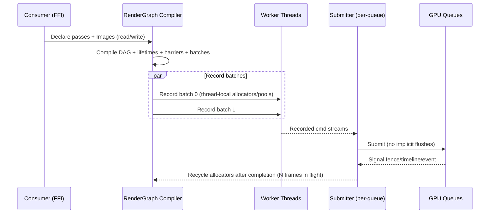
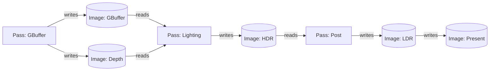
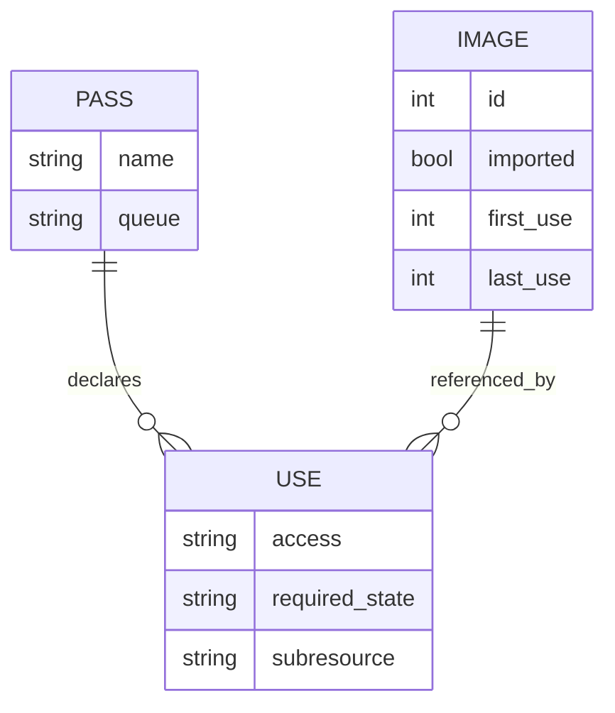

# Cross‑API Rust Graphics Engine Design with Slang Reflection

## Executive summary

This design doc proposes a **Rust-based, cross‑API graphics engine** targeting Vulkan, DirectX 12, and Metal, with **Slang-driven shader reflection** as the canonical source of truth for binding layouts and pipeline compatibility. Vulkan is standardized by entity["organization","Khronos Group","graphics standards consortium"], DirectX 12 is from entity["company","Microsoft","redmond, wa, us"], and Metal is from entity["company","Apple","cupertino, ca, us"]. The engine architecture is explicitly shaped around modern explicit APIs: **record work**, **derive dependencies from declared resource usage**, and **submit in large batches without implicit flushes**, using explicit fences/events/timeline primitives. Vulkan’s explicit sync model and “external synchronization” rules (notably queue submission and command pool usage) directly motivate a “single submission point per queue” and per-thread recording contexts. citeturn3search0turn3search5turn0search0

The central consumer requirements map naturally onto a render-graph–first design:

- Consumers should not care which API/GPU they are on **except for ray tracing availability**. This becomes a `supports_raytracing` capability query with an optional “advanced feature” surface for mesh shading and bindless tiers. citeturn9search3turn9search2turn0search2turn9search0
- A single `Image` type represents either a **GPU resource** or a **render target**; “screen” is just an imported `Image` representing a swapchain drawable. citeturn4search29turn7search13turn3search3
- Shaders can be built at runtime from inline or file sources, and can run with arbitrary input/output sets; the engine derives ordering from **who reads/writes which Images/Buffers** (render graph) and only submits when the consumer explicitly asks to flush/present. This aligns with render-graph systems described in Unreal RDG, Frostbite FrameGraph, AMD RPS, and EA SEED Halcyon. citeturn1search1turn1search10turn1search4turn1search6
- The API must be C-FFI-safe for consumers writing game logic in any language; use opaque handles and `#[repr(C)]` structs, and forbid panics crossing FFI. (Rust engineering choice; API facts cited where applicable.)

A practical implementation uses three layers:

1. **Thin backend**: minimal wrappers over native concepts (queues, command buffers/lists, fences/semaphores/events, descriptor sets/tables/argument buffers, pipelines/PSOs).  
2. **Middle utilities**: per-frame contexts, deferred destruction, transient allocators, descriptor allocators/rings, pipeline caches/libraries/binary archives.  
3. **High-level render graph**: compile pass/resource declarations into barriers + lifetimes + aliasing plan + multithreaded recording batches, then submit without implicit flushes. citeturn1search4turn1search1turn1search12turn7search5

## Architecture model and backend mapping

### Unified mental model across Vulkan, DirectX 12, and Metal

All three APIs converge on the same underlying structure:

- **Record** work into command containers (Vulkan command buffers, D3D12 command lists, Metal command buffers/encoders). citeturn3search5turn2search10turn4search29
- **Synchronize** explicitly (Vulkan fences/semaphores/timeline semaphores; D3D12 fences + resource barriers; Metal shared events/fences/hazard tracking). citeturn0search0turn2search3turn4search2turn4search30
- **Bind resources** explicitly (Vulkan descriptor sets / descriptor buffers; D3D12 root signatures + descriptor heaps; Metal argument buffers). citeturn8search19turn8search15turn2search1turn2search0turn4search14turn0search6
- **Use immutable pipeline objects** (Vulkan pipelines; D3D12 PSOs; Metal pipeline states). D3D12 explicitly states the only way to change pipeline state contained in the PSO is to bind a different PSO. citeturn8search0turn7search8turn4search13

The engine abstraction should therefore expose a small number of explicit primitives that can map 1:1 to each backend without hidden side effects.

### Shader IR targets and toolchain integration

For runtime compilation and reflection-driven layout:

- Vulkan consumes **SPIR-V** shader modules, and SPIR-V is specified as the intermediate language. citeturn3search5turn0search4turn0search0turn7search1
- D3D12 consumes **DXIL** (as compiled output of modern HLSL toolchains); DXIL is specified as a mapping of HLSL into LLVM IR suitable for GPU drivers. citeturn7search0turn7search3
- Metal uses **MSL** (Metal Shading Language), specified by Apple’s MSL specification. citeturn7search1turn7search13

Slang sits “above” these backends: it can provide reflection metadata and can target D3D12/DXIL, Vulkan/SPIR-V, and Metal/MSL workflows when configured appropriately, and its reflection API is explicitly designed to support binding-group mechanisms used by these targets. citeturn0search3turn0search31turn0search19

### Driver/validation layers and debugging contracts

The abstraction must treat validation and capture tooling as part of the design:

- Vulkan: minimal error checking in drivers is by design; `VK_LAYER_KHRONOS_validation` exists to catch incorrect usage. citeturn6search2turn6search9turn6search6  
- D3D12: the debug layer and GPU-based validation enable detection of issues only visible on the GPU timeline. citeturn5search0turn5search16  
- Metal: Xcode’s Metal API validation checks for incorrect resource creation/encoding/usage; Xcode supports capturing Metal workloads for analysis. citeturn6search0turn6search1turn6search5  
- Cross-API capture: RenderDoc is a frame-capture debugger available for Vulkan and D3D12 (among others). citeturn5search2  

The engine’s “debug personality” should enable these checks by default in dev builds and systematically label passes/resources so captures are readable (names are also important for render graph visualization tools). citeturn1search4turn5search1turn6search21

### Comparison table across APIs

| Attribute | Vulkan | DirectX 12 | Metal |
|---|---|---|---|
| Work submission | Command buffers submitted on queues; submission has explicit host synchronization requirements citeturn3search0turn3search5 | Command lists/bundles recorded then executed by command queues citeturn2search10turn2search18 | Command buffers represent chunks of GPU work; work encoded via encoders citeturn4search29turn4search17 |
| Sync primitives | Fences + semaphores (binary/timeline) + barriers; explicit memory/exec dependencies citeturn0search0turn0search20turn0search32 | Fences + resource barriers (transition/UAV/aliasing); barriers express before/after states citeturn2search3turn2search2turn2search11 | Shared events sync CPU/GPU; hazard tracking can be relied on or disabled for manual sync citeturn4search2turn4search5turn4search30 |
| Binding model | Descriptor sets/layouts; descriptor buffers as alternative; descriptor indexing for “bindless” citeturn8search19turn8search15turn8search7 | Root signatures + descriptors in descriptor heaps; heaps back descriptor tables citeturn2search1turn2search0turn2search12 | Argument buffers gather many resources into one shader argument; tiered support and explicit residency tracking citeturn4search14turn0search6turn0search22 |
| Multithread recording | Command pools are externally synchronized; per-thread pools are standard citeturn3search5turn3search9 | Command lists can be recorded on multiple threads; allocator reuse constraints drive per-thread-per-frame allocators citeturn2search18turn2search6 | Parallel render command encoding supported; indirect command buffers support multi-thread encoding/reuse citeturn4search0turn4search1 |
| Ray tracing | VK_KHR ray tracing extensions (sample: `ray_tracing_basic`) citeturn9search0turn9search8 | DXR is first-class peer to graphics/compute; raytracing tier query via CheckFeatureSupport citeturn0search5turn9search3turn9search15 | Device property `supportsRaytracing`; feature-set caveats in Apple tables citeturn9search2turn0search2turn9search10 |
| Mesh shading | VK_EXT_mesh_shader provides programmable mesh shading pipeline citeturn9search1turn9search21 | D3D12 mesh shader spec (next-gen VS/GS replacement) citeturn8search2turn8search6 | Mesh shading availability is GPU-family dependent (Metal feature set tables) citeturn0search2turn7search10 |
| Pipeline creation cost + caching | Pipeline creation can be costly; pipeline caches reduce stutter; pipeline binaries emerging citeturn7search5turn7search2turn7search23 | PSO is immutable; pipeline libraries reduce redundant/duplicated cached data overhead citeturn8search0turn8search1 | Pipeline creation expensive; Metal binary archives provide explicit caching control citeturn4search12turn4search26turn4search13 |
| Validation/capture tools | Unified validation layer; loader/layer mechanism; validation overview citeturn6search2turn6search9 | Debug layer + GPU-based validation; PIX is primary D3D12 profiling/capture tool citeturn5search0turn5search1 | Xcode Metal API validation and workload capture; Metal debugger citeturn6search0turn6search1turn6search5 |

## Multithreaded rendering and synchronization strategy

### Backend-specific constraints that drive the engine design

**Vulkan** has two critical host-threading constraints that must shape the abstraction:

- `vkQueueSubmit` requires external synchronization on the queue unless created with an internal synchronization bit; this motivates a **single submission thread per queue** or a per-queue mutex. citeturn3search0turn3search4  
- Command pools are externally synchronized: you must not record from command buffers allocated from the same pool concurrently across threads. This motivates **one command pool per worker thread per frame-in-flight**. citeturn3search5turn3search9  

**DirectX 12** multithreading is structured around command list recording and allocator reuse:

- Command lists and bundles are recorded for later execution; recording can be parallelized, but the runtime’s model forces you to manage synchronization and allocator lifetimes carefully. citeturn2search18turn2search10  
- The “before/after resource states at each barrier” model means your render graph’s barrier generator must produce accurate transitions and batch them. citeturn2search2turn2search11  

**Metal** enables parallel command encoding explicitly:

- `MTLParallelRenderCommandEncoder` supports encoding render commands in parallel across threads; the doc explicitly states you are responsible for thread synchronization. citeturn4search0turn4search9  
- `MTLIndirectCommandBuffer` supports “encode once, reuse” and multi-thread encoding (CPU/GPU), enabling GPU-driven workflows. citeturn4search1turn4search4  
- Shared events synchronize CPU and GPU, and can synchronize across devices/processes. citeturn4search2turn4search5  

### Engine recording model: per-thread contexts, centralized submit, allocator recycling

The engine should implement **thread-local recording contexts** and a **centralized submission point**:

- A `ThreadCtx` owns per-frame command allocators/pools and transient allocators.
- A `SubmitCtx` owns per-queue submission mutexes (Vulkan), queue objects, and fence/timeline management.
- A `FrameCtx` owns a completion signal (fence/timeline/shared event value) used to recycle per-frame-per-thread allocators safely.

This aligns with vendor guidance that encourages parallelizing command buffer recording and task-graph architectures that respect dependencies. citeturn5search3turn0search20

### Submission timeline diagram



## Render graph, resource chaining, and deferred submission semantics

### Why the render graph is non-negotiable for the stated requirements

The requirement “dependency logic derived from consumer use of images and reasoning which shaders must finish before others, without flushes” is exactly what a render graph does: it turns declared reads/writes into a DAG, then derives barriers, lifetimes, scheduling, and batching. Unreal’s `FRDGBuilder` explicitly states that “resource barriers and lifetimes are derived from RDG parameters” and the graph is compiled and executed. citeturn1search1turn1search3

This approach matches documented industry systems:

- Frostbite FrameGraph (GDC talk and slides) models passes and resources as a graph to maintain efficiency and modularity. citeturn1search2turn1search10  
- AMD RPS describes a render graph toolkit that handles barrier generation and transient memory aliasing with a compiler-like scheduler for explicit APIs. citeturn1search4turn1search12turn1search20  
- EA SEED Halcyon notes show a render graph inspired by Frostbite’s frame graph and emphasize automatic transitions and parallelized evaluation. citeturn1search6turn1search8  

### Resource and pass model

The core consumer-facing concept is:

- **`Image`**: a typed handle representing a texture-like GPU resource, potentially used as render target, sampled texture, storage image, or presentation surface. (Swapchain drawables are imported as Images.) Metal’s command buffer model includes the idea that a command buffer stores the commands you encode, plus resources those commands need. citeturn4search29turn4search17  
- **`Pass`**: a shader invocation (graphics, compute, mesh, RT) that declares which Images/Buffers it reads and writes.

Render-target chaining is just graph edges: A pass writes an Image; subsequent passes read it.



### Complete sample render-graph design in Rust-style pseudocode

#### Data structures

```rust
// --- FFI-friendly handles are u64 IDs; internal Rust wraps them in newtypes.
#[derive(Copy, Clone, Eq, PartialEq, Hash)]
pub struct ImageHandle(u64);

#[derive(Copy, Clone, Eq, PartialEq, Hash)]
pub struct BufferHandle(u64);

#[derive(Copy, Clone, Eq, PartialEq, Hash)]
pub struct PassHandle(u32);

#[derive(Copy, Clone)]
pub enum QueueType { Graphics, Compute, Transfer }

#[derive(Copy, Clone)]
pub enum Access { Read, Write, ReadWrite }

#[derive(Copy, Clone)]
pub enum RgState {
    ShaderRead,
    ShaderWrite,
    RenderTarget,
    DepthRead,
    DepthWrite,
    CopySrc,
    CopyDst,
    Present,
}

#[derive(Copy, Clone)]
pub struct SubresourceRange {
    pub base_mip: u16, pub mip_count: u16,
    pub base_layer: u16, pub layer_count: u16,
}

pub struct Use {
    pub image: ImageHandle,
    pub access: Access,
    pub required: RgState,
    pub sub: SubresourceRange,
}

pub struct PassDesc {
    pub name: String,
    pub queue: QueueType,
    pub reads: Vec<Use>,
    pub writes: Vec<Use>,
    pub record: fn(&mut CommandCtx, &PassResources),
}

// Internal representation
pub struct VirtualImage {
    pub first: u32,
    pub last: u32,
    pub desc: ImageDesc,
    pub imported: bool,
}

pub struct Barrier {
    pub image: ImageHandle,
    pub sub: SubresourceRange,
    pub before: RgState,
    pub after: RgState,
    pub queue: QueueType,
}

pub struct RecordBatch {
    pub queue: QueueType,
    pub pass_indices: Vec<u32>,     // topologically sorted indices
}

pub struct CompiledGraph {
    pub passes: Vec<PassDesc>,
    pub images: Vec<VirtualImage>,
    pub barriers_per_pass: Vec<Vec<Barrier>>,
    pub batches: Vec<RecordBatch>,
    pub alias_plan: AliasPlan,      // transient allocations + aliasing
}
```

#### Compile algorithm: lifetime, aliasing, barrier generation, batching

Key goals:

1. **Derive dependencies** from read-after-write / write-after-read hazards on the same Image/subresource.  
2. Compute **lifetime ranges** `[first_use, last_use]` for transient Images.  
3. Compute an **aliasing plan** (transient heap reuse) when lifetimes do not overlap. D3D12 explicitly supports aliasing barriers for overlapping heap mappings, making aliasing a first-class target for render-graph scheduling. citeturn2search3turn2search11  
4. Generate **barrier batches** per pass (Vulkan/D3D12 style) or synchronization boundaries/events (Metal mapping). Vulkan’s synchronization chapter defines explicit execution and memory dependencies; D3D12 requires before/after states at each barrier. citeturn0search0turn2search2  
5. Partition into **record batches** that can be encoded in parallel given backend constraints (Vulkan command pools external sync; D3D12 allocator constraints; Metal parallel render encoders). citeturn3search5turn2search18turn4search0

```rust
impl RenderGraph {
    pub fn compile(&self, device: &Device) -> CompiledGraph {
        // 1) Build dependency edges from declared reads/writes.
        // 2) Topologically sort passes.
        let order: Vec<u32> = topo_sort(&self.passes);

        // 3) Lifetime analysis for each virtual image.
        let mut images = self.images.clone();
        for img in &mut images { img.first = u32::MAX; img.last = 0; }
        for (i, &pidx) in order.iter().enumerate() {
            let pass = &self.passes[pidx as usize];
            for u in pass.reads.iter().chain(pass.writes.iter()) {
                let v = &mut images[image_index(u.image)];
                v.first = v.first.min(i as u32);
                v.last  = v.last.max(i as u32);
            }
        }

        // 4) Transient aliasing plan (simple greedy).
        let alias_plan = AliasPlan::build(&images, device);

        // 5) Barrier generation using a per-image state tracker.
        let mut tracker = StateTracker::new();
        let mut barriers_per_pass = vec![Vec::new(); order.len()];
        for (i, &pidx) in order.iter().enumerate() {
            let pass = &self.passes[pidx as usize];
            barriers_per_pass[i] = tracker.compute_barriers(pass);
            tracker.apply(pass);
        }

        // 6) Partition into record batches for parallel encoding.
        // Must respect: per-thread command pools/allocators/Metal encoder rules.
        let batches = partition_for_parallel_recording(&order, &self.passes);

        CompiledGraph {
            passes: order.iter().map(|&i| self.passes[i as usize].clone()).collect(),
            images,
            barriers_per_pass,
            batches,
            alias_plan,
        }
    }
}
```

#### Execution model: multithreaded recording + deferred submission + explicit flush

The consumer requirement “no flush unless explicitly asked” implies:

- Engine collects passes into a `FrameBuilder`.
- Engine does not submit GPU work until `frame.flush()` or `frame.present()`.
- `frame.present()` implies a flush and returns quickly; CPU waits only if consumer calls `device.wait_frame()` or a blocking `present_and_wait()` convenience.

This maps naturally to D3D12’s explicit submission and to Vulkan/Metal’s explicit command buffer submission model. citeturn2search10turn3search0turn4search29

```rust
impl FrameBuilder {
    pub fn flush(&mut self) -> GpuSignal {
        let compiled = self.graph.compile(&self.device);

        // 1) Parallel record.
        parallel_for(&compiled.batches, |batch, worker_idx| {
            let mut ctx = self.device.acquire_thread_ctx(worker_idx, batch.queue, self.in_flight_index);
            ctx.begin();

            for &pass_i in &batch.pass_indices {
                ctx.apply_barriers(&compiled.barriers_per_pass[pass_i as usize]);
                let pass = &compiled.passes[pass_i as usize];

                // Resolve pass resources (descriptor tables/sets/arg buffers)
                // from Slang reflection + bound resources.
                let resources = self.resolve_pass_resources(pass);

                (pass.record)(&mut ctx, &resources);
            }

            ctx.end();
            self.device.store_recorded(worker_idx, batch.queue, ctx.finish());
        });

        // 2) Submit (serialized per queue).
        // Vulkan requires external sync on VkQueue submission. D3D12/Metal still benefit from central submit. citeturn3search0turn2search10turn4search29
        let signal = self.device.submit_recorded(&compiled);

        // 3) Retire transient resources only after completion signal.
        self.device.defer_recycle(compiled.alias_plan, signal);

        self.submitted = true;
        signal
    }

    pub fn present(&mut self) -> PresentToken {
        if !self.submitted {
            self.flush();
        }
        self.device.present_swapchain_image()
    }
}
```

### Resource relationship diagram



## Slang shader system and reflection-driven pipelines

### Canonical binding layouts via Slang parameter blocks

Slang’s documentation and reflection guide explicitly describe that modern API targets (D3D12/DXIL, Vulkan/SPIR-V) require shader parameters to be bound via grouping mechanisms (descriptor tables, descriptor sets), and Slang may wrap global parameters into a default `ParameterBlock<>` if no explicit space is specified. citeturn0search31turn0search3

**Design choice:** treat Slang `ParameterBlock<>` as the engine’s canonical “bind group.” Slang’s parameter blocks map naturally to:

- Vulkan descriptor sets  
- D3D12 descriptor tables (root signature descriptor tables)  
- Metal argument buffers citeturn0search3turn0search31turn4search14

This lets the engine synthesize backend binding layouts deterministically from reflection.

### Reflection-driven pipeline layout generator

Key constraints from the backends:

- Vulkan: descriptor sets/layouts define what descriptors can be stored; descriptor buffers provide an alternative where descriptors are stored in GPU-readable buffers. citeturn8search19turn8search15turn8search7  
- D3D12: root signature is “like an API function signature” describing what shaders expect; descriptors live in descriptor heaps and are referenced via descriptor tables. citeturn2search1turn2search0turn2search12  
- Metal: argument buffers gather multiple resources into a single shader argument; tier 2 increases capability and residency tracking must be handled explicitly for argument-buffer referenced resources. citeturn4search14turn0search6turn0search22  

Pseudocode:

```rust
/// Canonical binding model independent of backend.
pub struct CanonicalGroupLayout {
    pub name: String,                // parameter block name
    pub bindings: Vec<CanonicalBinding>,
}

pub struct CanonicalBinding {
    pub path: String,                // stable full path from reflection
    pub kind: BindingKind,            // texture/buffer/sampler/as
    pub count: u32,                  // arrays/bindless
    pub stage_mask: StageMask,
    pub update_rate: UpdateRate,     // Frame/Pass/Material/Draw
}

pub struct CanonicalPipelineLayout {
    pub groups: Vec<CanonicalGroupLayout>,
    pub push_constants_bytes: u32,
}

/// Build CanonicalPipelineLayout from Slang reflection.
pub fn build_layout_from_slang(refl: &SlangProgramLayout) -> CanonicalPipelineLayout {
    // Walk parameter blocks, extract bindings, normalize ordering,
    // compute stable "path" identifiers.
    todo!()
}

/// Backend translation.
pub fn create_backend_layout(api: Api, c: &CanonicalPipelineLayout) -> BackendPipelineLayout {
    match api {
        Api::Vulkan => create_vk_pipeline_layout(c),
        Api::D3D12  => create_d3d12_root_signature(c),
        Api::Metal  => create_metal_argument_buffer_layouts(c),
    }
}
```

A subtle but important Slang reflection detail: Slang’s internal “set indices” may not equal Vulkan descriptor set indices in some cases; Slang discussions and issues highlight the need to apply descriptor set space offsets when extracting Vulkan binding indices. citeturn0search23turn0search31

### Runtime shader construction and hot reload

Requirements:

- Compile shaders from **inline sources** and **files** at runtime.
- Shaders can be used to draw to swapchain (screen) or any `Image`.
- Hot reload should invalidate dependent pipelines and recompile.

Implementation strategy:

1. A `ShaderModule` stores `(source_hash, entry_points, slang_profile, target_api)` and compiled artifacts:
   - SPIR-V for Vulkan citeturn0search4turn3search5  
   - DXIL for D3D12 citeturn7search0turn7search3  
   - MSL / Metal library/pipeline functions for Metal citeturn7search1turn7search13  
2. A `PipelineKey` includes:
   - Canonical reflection layout hash (sorted bindings, update-rates),
   - render target formats / depth format / sample count,
   - shader specialization/permutation constants,
   - fixed-function state.
3. Rebuild pipeline objects on cache miss; do not compile pipelines during draw submission.

Pipeline caching primitives differ per backend:

- Vulkan: pipeline cache reduces stutter and pipeline creation is “somewhat costly” due to shader compilation; pipeline cache can be saved between runs. citeturn7search5turn7search2  
- D3D12: pipeline libraries reduce overhead by grouping PSOs expected to share data before serialization. citeturn8search1turn8search13  
- Metal: Metal binary archives provide explicit caching control; WWDC notes emphasize collecting compiled PSOs and distributing to compatible devices. citeturn4search12turn4search26  

## Rust API surface and C FFI

### Handle model and safe/unsafe boundaries

To be FFI-friendly and language-agnostic, expose opaque handles (u64) and `#[repr(C)]` structs:

- **Opaque handles**: `u64` generational IDs (index + generation counter).  
- **No panics across FFI**: all public `extern "C"` functions must catch unwinding and return error codes; never propagate Rust panics into C.  
- **Ownership**: C API uses explicit `create/destroy` for resources; Rust internal uses RAII, but FFI boundary must not rely on drop timing.

### Core consumer-visible types

Key requirement: “There is an image type which represents either a GPU resource or a render target.” That suggests a single `Image` handle with:

- `usage` flags: sampled, storage, render target, depth/stencil, present  
- `format`, `extent`, `mips`, `layers`, `samples`  
- optionally: externally-owned imported images (swapchain, user-provided native texture)

Metal’s command organization explicitly includes a blit encoder that can do mipmap generation, which justifies treating “mips” as a first-class capability in the `Image` API. citeturn4search17turn0search2

Rust-style pseudocode:

```rust
bitflags::bitflags! {
  pub struct ImageUsage: u32 {
    const SAMPLED      = 1 << 0;
    const STORAGE      = 1 << 1;
    const RENDER_TARGET= 1 << 2;
    const DEPTH_STENCIL= 1 << 3;
    const PRESENT      = 1 << 4; // only for imported swapchain images
  }
}

#[repr(C)]
pub struct ImageDesc {
  pub width: u32,
  pub height: u32,
  pub mip_levels: u16,
  pub layers: u16,
  pub format: Format,
  pub usage: ImageUsage,
}

pub struct Image {
  handle: ImageHandle,
  desc: ImageDesc,
}
```

### C header sketch for consumers

```c
// --- Opaque handles
typedef struct gfx_device_t { uint64_t h; } gfx_device_t;
typedef struct gfx_image_t  { uint64_t h; } gfx_image_t;
typedef struct gfx_shader_t { uint64_t h; } gfx_shader_t;
typedef struct gfx_frame_t  { uint64_t h; } gfx_frame_t;

typedef enum gfx_result_t {
  GFX_OK = 0,
  GFX_ERR_INVALID_HANDLE = 1,
  GFX_ERR_UNSUPPORTED = 2,
  GFX_ERR_COMPILE_FAILED = 3,
  GFX_ERR_OUT_OF_MEMORY = 4,
  GFX_ERR_UNKNOWN = 0x7fffffff
} gfx_result_t;

typedef struct gfx_caps_t {
  uint32_t supports_raytracing;   // the one most users care about
  uint32_t supports_mesh_shading;
  uint32_t supports_bindless;
  uint32_t max_mip_levels;
  uint32_t max_frames_in_flight;
} gfx_caps_t;

// Device
gfx_result_t gfx_create_device(gfx_device_t* out);
gfx_result_t gfx_destroy_device(gfx_device_t dev);
gfx_result_t gfx_get_caps(gfx_device_t dev, gfx_caps_t* out_caps);

// Images
typedef struct gfx_image_desc_t {
  uint32_t width, height;
  uint16_t mip_levels, layers;
  uint32_t format;
  uint32_t usage_flags;
} gfx_image_desc_t;

gfx_result_t gfx_create_image(gfx_device_t dev, const gfx_image_desc_t* desc, gfx_image_t* out);
gfx_result_t gfx_destroy_image(gfx_device_t dev, gfx_image_t img);

// Shaders (inline or file)
typedef struct gfx_shader_desc_t {
  const char* source_utf8;   // optional if file path provided
  const char* file_path_utf8;
  const char* entry_point_utf8;
  const char* stage_utf8;    // "compute", "vertex", "fragment", "mesh", "raygen", etc.
} gfx_shader_desc_t;

gfx_result_t gfx_create_shader(gfx_device_t dev, const gfx_shader_desc_t* desc, gfx_shader_t* out);

// Frame graph-like API
gfx_result_t gfx_begin_frame(gfx_device_t dev, gfx_frame_t* out_frame);
gfx_result_t gfx_frame_add_pass(gfx_frame_t frame, /* reads/writes arrays */, /* shader */, /* params */);

// Deferred submission
gfx_result_t gfx_frame_flush(gfx_frame_t frame);     // submit without wait
gfx_result_t gfx_frame_present(gfx_frame_t frame);   // flush + present
gfx_result_t gfx_frame_wait(gfx_frame_t frame);      // CPU wait (explicit)
```

### Flush semantics and “fire it off all at once”

Vulkan and D3D12 are explicit submission models; Metal command buffers are explicit recording/commit units. The engine’s deferred submission semantics should ensure:

- API calls that declare work (create passes, bind resources) do **not** implicitly submit to GPU queues.
- Only `flush/present` produce actual queue submissions.
- CPU waits only occur if consumers call `wait` or use a blocking present.

This is consistent with D3D12’s model where apps record GPU commands and submit via command queues, and with Vulkan’s explicit queue submission requiring host synchronization. citeturn2search10turn3search0turn4search29

## Capability system and advanced features

### Consumer-facing rule: only ray tracing requires hardware awareness

Expose one “simple” query:

- `supports_raytracing`: required for ray tracing usage.

Backend support detection:

- D3D12: `ID3D12Device::CheckFeatureSupport` with `D3D12_FEATURE_DATA_D3D12_OPTIONS5` and `RaytracingTier`. citeturn9search3turn9search15  
- Metal: `MTLDevice.supportsRaytracing`. citeturn9search2  
- Vulkan: require the ray tracing extension set (e.g., `VK_KHR_ray_tracing_pipeline`, `VK_KHR_acceleration_structure`) as demonstrated by Khronos samples. citeturn9search0turn9search8  

### Advanced capability surface

To satisfy “mesh shading, bindless tiers, instancing, mips,” expose a richer `Caps`:

- `supports_mesh_shading`:
  - D3D12: mesh shader spec exists and support is device/driver dependent; sample set exists. citeturn8search2turn8search10  
  - Vulkan: `VK_EXT_mesh_shader`. citeturn9search1turn9search5  
  - Metal: per-GPU-family support in feature set tables. citeturn0search2turn7search10  
- `supports_bindless`:
  - Vulkan: descriptor indexing is explicitly feature-gated; descriptor buffers are a distinct design option. citeturn8search7turn8search15turn8search3  
  - D3D12: descriptor heaps are backing memory for descriptors; heap binding constraints matter for bindless strategies. citeturn2search0turn2search12  
  - Metal: argument buffer tier 2 availability via `MTLArgumentBuffersTier.tier2`. citeturn0search6turn0search18  
- `max_mip_levels` and “mip generation support”: Metal’s blit encoder supports mipmap generation; Vulkan/D3D12 can implement mip generation via compute/blit pipelines, but that is an engine technique. citeturn4search17turn0search2  

### Portability: macOS Vulkan and MoltenVK

On macOS, Vulkan support is commonly provided via MoltenVK as a portability/translation layer; LunarG’s macOS Vulkan SDK documentation states the SDK provides **partial** Vulkan support through MoltenVK mapping most of Vulkan to Metal. citeturn6search10

The Vulkan portability initiative introduces `VK_KHR_portability_enumeration` so apps can opt into enumerating portability (non-conformant) implementations, and the Vulkan spec exposes the `VK_INSTANCE_CREATE_ENUMERATE_PORTABILITY_BIT_KHR` behavior. citeturn6search24turn6search27turn6search13

**Design implication:** your capability system must treat “Vulkan on macOS” as a portability-subset device with potentially different feature/extension availability than native Vulkan on Windows/Linux.

## Performance, pitfalls, and tooling

### Pipeline creation and shader compilation stalls

Pipeline creation cost is a cross-API pitfall:

- Vulkan: pipeline creation can be costly; pipeline caches eliminate some expensive portions by reusing cached data between runs, and the Vulkan samples demonstrate noticeable slowdowns when caches are disabled or pipelines are recreated. citeturn7search5turn7search2  
- D3D12: PSOs are immutable; pipeline libraries help reduce overhead and redundant data when serializing caches. citeturn8search0turn8search1  
- Metal: pipeline state creation is expensive; Apple’s WWDC “Build GPU binaries with Metal” describes Metal binary archives as explicit control over pipeline state caching and distribution to compatible devices. citeturn4search12turn4search13  

Mitigation strategy: compile pipelines asynchronously (load-time or background), and keep robust persistent caches keyed by reflection-derived layout + fixed-function state.

### Descriptor/binding overhead and stalls

Binding overhead and stalls are commonly caused by mismatched binding models:

- Vulkan: descriptors are organized in descriptor sets with layouts defining arrangement; descriptor buffers change the model by placing descriptor data into application-managed buffers. citeturn8search19turn8search15turn8search7  
- D3D12: descriptor heaps provide backing memory; rapid switching requires heap space to define descriptor tables “on the fly,” motivating stable heap strategies for a frame or more. citeturn2search0turn2search12  
- Metal: argument buffers allow assigning once and reusing many times, reducing CPU overhead; residency tracking is required because the driver can’t automatically track residency of argument buffer resources. citeturn4search14turn0search22  

### Synchronization mistakes and over-synchronization

Over-synchronization leads to GPU bubbles; under-synchronization leads to hazards.

- Vulkan: synchronization defines explicit execution/memory dependencies; queue submit is thread-sensitive; the Vulkan Guide explicitly discusses swapchain semaphore reuse correctness and validation layer behavior changes (SDK 1.4.313). citeturn0search0turn3search0turn3search3  
- D3D12: barriers require before/after states and are typically managed within command lists; transitions should be batched for performance. citeturn2search2turn2search11  
- Metal: shared events synchronize CPU/GPU work; hazard tracking offers safety but may impose overhead; advanced engines may choose manual synchronization. citeturn4search2turn4search22  

### Validation and debugging workflow

The engine should bake in “debug hooks”:

- Vulkan: enable `VK_LAYER_KHRONOS_validation` in dev builds; Vulkan validation overview notes unified validation layer. citeturn6search2turn6search9  
- D3D12: use debug layer + GPU-based validation; use PIX for GPU captures and timing captures. citeturn5search0turn5search1turn5search13  
- Metal: use Xcode Metal API validation and capture Metal workloads in Xcode; Metal developer tools highlight validation and profiling toolchain. citeturn6search0turn6search1turn6search21  
- Use RenderDoc for Vulkan/D3D12 frame capture where applicable. citeturn5search2  

## Sources

- Vulkan `vkQueueSubmit` host synchronization rule (queue externally synchronized). citeturn3search0  
- Vulkan command pools are externally synchronized (no concurrent use across threads). citeturn3search5turn3search9  
- Vulkan synchronization chapter (execution and memory dependencies). citeturn0search0turn0search4  
- Vulkan memory allocation guidance (sub-allocation; `maxMemoryAllocationCount`). citeturn3search2  
- Vulkan swapchain semaphore reuse guidance and validation behavior notes. citeturn3search3  
- Vulkan descriptor sets and descriptors overview. citeturn8search19  
- Vulkan descriptor buffers guide/spec/sample. citeturn8search7turn8search15turn8search3  
- Vulkan pipeline cache guide and sample. citeturn7search5turn7search2  
- Vulkan mesh shading extension proposal and blog. citeturn9search1turn9search21  
- Vulkan ray tracing sample and Khronos blog. citeturn9search0turn9search8  
- D3D12 descriptor heaps overview. citeturn2search0  
- D3D12 root signatures overview and creating a root signature. citeturn2search1turn2search9  
- D3D12 command queues/lists and command list recording. citeturn2search10turn2search18  
- D3D12 resource barriers and barrier batching guidance. citeturn2search3turn2search11  
- D3D12 PSO immutability (`ID3D12PipelineState`) and pipeline libraries. citeturn8search0turn8search1  
- DXR functional spec and `CheckFeatureSupport` ray tracing tier querying. citeturn0search5turn9search3turn9search15  
- D3D12 mesh shader spec. citeturn8search2turn8search6  
- DXIL specification (DXC). citeturn7search0turn7search3  
- Metal command buffer model and command organization (including mipmap generation in blit encoder). citeturn4search29turn4search17  
- Metal parallel render command encoder and indirect command buffers. citeturn4search0turn4search1turn4search4  
- Metal shared events and CPU↔GPU synchronization docs. citeturn4search2turn4search5turn4search22  
- Metal argument buffers overview and tier 2 support; residency tracking for argument buffers. citeturn4search14turn0search6turn0search22  
- Metal ray tracing support property (`supportsRaytracing`) and Metal feature set tables (Feb 2026). citeturn9search2turn0search2  
- Metal pipeline caching: WWDC “Build GPU binaries with Metal” (binary archives). citeturn4search12turn4search26  
- Metal validation and capture in Xcode. citeturn6search0turn6search1turn6search5  
- Vulkan validation layer docs and validation overview. citeturn6search2turn6search9turn6search6  
- D3D12 GPU-based validation and PIX overview / GPU captures. citeturn5search0turn5search1turn5search13  
- RenderDoc repository (cross-API frame capture availability). citeturn5search2  
- NVIDIA Vulkan Do’s and Don’ts (parallelization/task-graph guidance). citeturn5search3  
- Unreal RDG `FRDGBuilder` doc statement about derived barriers/lifetimes. citeturn1search1turn1search3  
- Frostbite FrameGraph slides/talk listing. citeturn1search10turn1search2  
- AMD RPS SDK overview and introduction (barriers + transient aliasing scheduler for explicit APIs). citeturn1search4turn1search12turn1search20  
- EA SEED Halcyon architecture notes (render graph inspiration and goals). citeturn1search6turn1search8  
- Slang parameter blocks and reflection API guide (binding-group mechanisms). citeturn0search3turn0search31turn0search11  
- Slang reflection/Vulkan binding extraction caveat (descriptor set space offsets). citeturn0search23  
- Vulkan portability enumeration extension and macOS Vulkan SDK notes about MoltenVK partial support. citeturn6search24turn6search27turn6search10turn6search13