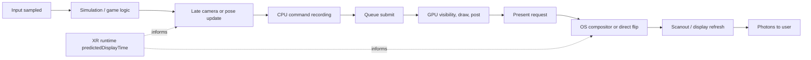
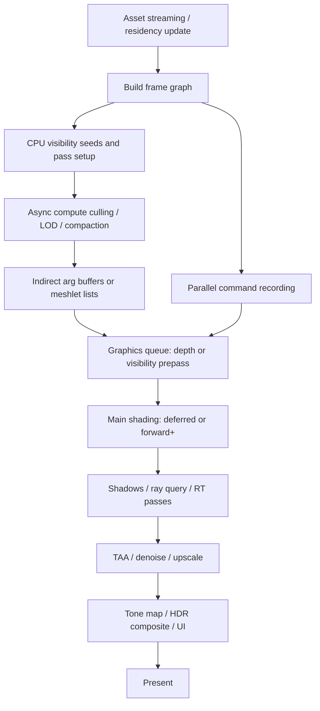

# Modern Real-Time Graphics That Look Great and Perform Well

## Executive summary

Target platforms were unspecified, so the most defensible cross-platform target is a renderer architecture that treats **Vulkan, Direct3D 12, and Metal as first-class backends**, while treating **OpenGL or OpenGL ES as a compatibility fallback** rather than the primary design center. That is where the modern feature set lives: explicit resource state management, descriptor-based or bindless-style resource access, multithreaded command generation, indirect and device-generated work, async compute, standardized ray tracing, variable-rate shading or rasterization-rate control, mesh shading, sparse or virtualized resources, and persistent pipeline compilation artifacts. Vulkan is explicitly positioned as a cross-platform explicit API and now has current registry specification updates through Vulkan 1.4.351; Direct3D 12 exposes the same class of explicit control on Windows; and Metal exposes parallel low-overhead graphics/compute with argument buffers, indirect command buffers, sparse textures, binary archives, and ray tracing on supported Apple GPUs. OpenGL can still do useful compatibility work with persistent mapped buffers, multi-draw indirect, compute, sparse textures, and bindless textures, but it is not the best primary abstraction for a new high-end engine. citeturn17search9turn23search2turn14search13turn5search7turn24search2turn24search0turn24search11turn24search14turn39search21

The main analytical conclusion is that **visual quality and performance are no longer separable problems**. The best-looking modern engines are structured around a retained-mode render graph or frame graph, aggressive GPU visibility work, robust resource streaming and residency systems, carefully managed shader and pipeline compilation, and a temporal reconstruction stack that includes TAA, denoising, temporal upscaling, tone mapping, and HDR-aware compositing. In practice, an engine usually wins not by any single “killer feature,” but by making every stage cheap enough and stable enough that temporal methods can accumulate information across frames without visible instability. Frostbite’s frame-graph work is still representative of the architectural direction: build rendering as explicit passes and resources, compile the graph, alias transient resources, and automate synchronization and lifetime decisions. citeturn19search0turn20search0turn25search17turn14search10turn39search9turn34search18turn34search11

The second conclusion is that **low latency is a whole-stack problem**. Operating systems and compositors decide a great deal of present behavior; graphics APIs expose present modes, frame-latency controls, and queue synchronization primitives; and the engine decides when input is sampled, how many frames are queued, how long compute jobs run before yielding to graphics, and whether tracking or camera state is refreshed late. Windows flip-model swap chains and waitable objects, Vulkan present mode selection, Metal display-link pacing and drawable count control, and OpenXR’s predicted display time all show that low visual latency is not just “render faster”; it is “render with the right cadence and the smallest safe amount of buffering.” citeturn8search1turn8search0turn9search0turn12search0turn12search8turn8search2turn10search13

The third conclusion is that **recent research is pushing production engines in three directions at once**: more GPU-generated geometry and visibility work, more temporal or neural reconstruction, and more out-of-core, foveated, or streamed representations to keep memory and latency under control. The latest papers that are most relevant to shipping engines are not uniform “drop-ins”; they are signals about where implementations are headed. The most useful recent work, as of May 2026, clusters around neural denoising, neural or wavelet super-resolution, mesh-shader-generated detail, GPU-side procedural geometry, out-of-core rendering, and latency-aware foveated or streamed representations. citeturn37search1turn37search2turn37search3turn13search11turn37search7turn38search0turn38search1

## Core graphics API capabilities

A modern high-end engine needs the API to expose a **small set of non-negotiable explicit controls**: resource lifetime and memory placement, explicit synchronization and queueing, programmable shader stages with subgroup or wave-style operations, scalable resource binding, reusable pipeline objects, and enough GPU-side dispatch and indirect drawing support to keep scene traversal off the CPU. The precise spelling differs by API, but the capability classes are now very clear and broadly convergent. citeturn27search16turn26search1turn39search1turn14search9turn14search1

| Capability | Vulkan | Direct3D 12 | Metal | OpenGL fallback | Why it matters |
|---|---|---|---|---|---|
| Explicit resource binding | Descriptor sets and layouts; descriptor indexing is a modern portability target; descriptor buffers are an advanced path. citeturn27search16turn23search4turn27search2 | Descriptor heaps, descriptor tables, and root signatures; SM 6.6 dynamic resources allow direct heap indexing. citeturn26search1turn4search2turn26search2turn26search5 | Argument buffers group resources and support bindless-style access patterns. citeturn39search1turn39search0turn5search13 | Bindless textures, ARB_gl_spirv, and older binding models coexist. citeturn24search14turn24search7 | Lets the engine move from per-draw rebinding to large descriptor tables or scene-wide resource tables. |
| Memory placement and residency | Explicit memory model; portability depends on queried features and limits. citeturn17search9turn23search4 | Resources, heaps, placed resources, tiled resources, and sampler feedback. citeturn25search9turn32search0turn32search18 | Heaps, sparse textures, fast resource loading, and residency tracking for argument buffers. citeturn5search2turn32search2turn39search11 | ARB_sparse_texture, ARB_sparse_buffer, persistent mapping. citeturn6search1turn6search7turn24search2 | Makes virtual texturing, mesh streaming, and transient allocation practical. |
| Explicit synchronization | Synchronization2, barriers, queue ownership, timeline semaphores. citeturn23search4turn27search11 | Resource barriers, fences, multi-engine sync. citeturn25search17turn33search16 | Barriers, fences, events, and shared events. citeturn39search9turn39search14turn39search4 | Sync objects plus mostly driver-managed hazards. citeturn24search18turn6search3 | Required for correctness and for overlapping copy, compute, and graphics work. |
| Multithreaded command generation | Per-thread command pools; secondary command buffers. citeturn14search15turn14search0turn14search6 | Command lists and bundles can be recorded and submitted from multiple threads. citeturn14search14turn14search13turn14search7 | Parallel render command encoders and indirect command buffers. citeturn14search2turn15search7 | Limited explicit multithreading relative to newer APIs. citeturn24search0turn24search2 | Prevents the CPU submission path from becoming the frame bottleneck. |
| GPU-driven rendering | Multi-draw indirect, indirect count, and device-generated commands. citeturn33search17turn33search5turn33search9turn31search10 | ExecuteIndirect and indirect drawing. citeturn33search8turn33search0turn33search4 | Indirect command buffers on CPU or GPU. citeturn15search7turn39search12 | Multi-draw indirect and indirect parameters. citeturn24search0turn24search3 | Moves culling, LOD, and draw compaction to the GPU. |
| Async compute and multi-queue work | Multiple queues; explicit queue synchronization. citeturn14search3turn14search10 | Independent direct, compute, and copy queues with explicit synchronization. citeturn33search16turn14search10 | Compute and graphics share a unified API; events synchronize across queues. citeturn14search8turn39search9 | Limited and driver-mediated compared with explicit APIs. citeturn24search11turn24search18 | Needed for concurrent culling, post, denoising, and copy workloads. |
| Ray tracing | KHR acceleration structures, ray tracing pipeline, and ray query. citeturn28search14turn28search13turn28search16turn28search4 | DXR state objects, shader tables, local/global root signatures. citeturn3search6turn4search5turn26search8 | Acceleration structures and ray tracing support on supported Apple GPUs. citeturn5search5turn5search15 | No standardized cross-vendor modern RT path. citeturn24search9turn39search21 | Enables hybrid shadows, reflections, GI probes, and path-traced modes. |
| Variable shading rate | KHR fragment shading rate. citeturn29search15turn29search3 | Tiered VRS, base shading rate, and shading-rate images. citeturn30search0turn30search5turn30search12turn30search13 | Rasterization-rate maps and variable rasterization rate. citeturn15search6turn15search9turn29search11 | No standardized equivalent at this level. citeturn24search9 | Trades perceptual quality for fill/shading performance. |
| Mesh shading | VK_EXT_mesh_shader. citeturn31search0turn31search1 | Mesh and amplification shaders; meshlets are the practical content unit. citeturn4search0turn31search2turn31search20 | Object and mesh shaders, with samples showing meshlet LOD. citeturn15search1turn15search5turn39search12 | No modern core cross-vendor equivalent. citeturn24search9 | Best used with meshletized assets, GPU culling, LOD, and procedural detail. |
| Pipeline reuse and caching | Pipeline cache and pipeline libraries are part of the modern Vulkan toolbox. Ray tracing also integrates with pipeline libraries. citeturn28search0turn23search4 | Cached PSO blobs and pipeline libraries. citeturn25search0turn25search4turn25search7 | Binary archives, dynamic libraries, and compiler/archive workflows. citeturn16search0turn16search4turn16search6turn16search10 | Historically weaker and more driver-managed. citeturn24search9 | Avoids runtime hitches from shader or PSO compilation. |
| Multi-GPU and portability | Device groups, portability subset, portability enumeration, and Vulkan Profiles. citeturn23search0turn23search5turn17search1turn17search2turn23search8 | Multi-adapter node model. citeturn22search1 | Multiple GPU devices and shared events across devices. citeturn22search14turn22search16turn39search4 | Compatibility-only path; not a strategic target for high-end new work. citeturn39search21 | Feature-query-driven fallback design matters more than theoretical feature parity. |

Two clarifications matter. First, **meshlets are not an API feature**; they are an engine asset and culling unit that becomes especially valuable when paired with mesh shaders or GPU-driven classic draws. Microsoft’s mesh shader samples explicitly frame the projects as an introduction to meshlets and mesh shaders, and Apple’s mesh-shader sample likewise uses meshlets as the object/mesh-shader work unit. citeturn31search2turn39search12

Second, **bindless is not one thing**. In Vulkan it usually means descriptor indexing or a descriptor-buffer path over large descriptor address spaces; in Direct3D 12 it means large descriptor heaps plus root-signature policy and often SM 6.6 dynamic resources; in Metal it means argument buffers and indexed access to resource tables. An engine abstraction should therefore target the concept of **scene-wide resource indexing**, not one backend’s binding object. citeturn27search2turn26search2turn39search1

## Engine subsystems and how they map onto API features

The renderer architecture that now dominates high-end engines is a **frame graph or render graph**. Frostbite’s public frame-graph talk described exactly the responsibilities engines still need today: represent passes and resources explicitly, compile the dependence graph each frame, infer transitions and lifetimes, alias transient resources where legal, and keep feature code modular without losing performance. This model is a natural fit for Vulkan barriers and Vulkan/Direct3D/Metal transient allocation strategies because it turns synchronization into a graph problem instead of an ad hoc pile of barriers inside every pass. citeturn19search0turn20search0turn25search17turn39search9

| Engine subsystem | API features it leans on | Why it exists |
|---|---|---|
| Render graph / frame graph | Explicit barriers, queue ownership, render-pass or dynamic-rendering metadata, transient allocations, pipeline compatibility. citeturn19search0turn25search17turn23search4turn39search9 | Centralizes pass ordering, resource lifetime, aliasing, and async scheduling decisions. |
| Memory allocator and residency manager | Heaps/placed resources, sparse or tiled resources, fast loading, residency feedback where available. citeturn25search9turn32search0turn32search2turn32search20 | Prevents fragmentation, controls working set, and keeps visible content resident. |
| Shader compilation and pipeline manager | Shader libraries, binary archives, pipeline libraries, cached PSO blobs, offline variants. citeturn16search4turn16search6turn25search4turn25search7 | Prevents stutter and controls variant explosion. |
| Visibility, culling, and LOD | Indirect draws, ExecuteIndirect, indirect count, ICBs, mesh shaders, visibility buffers or occlusion results. citeturn33search17turn33search4turn33search2turn15search7turn15search5 | Keeps the CPU out of per-object decision-making and scales scene complexity. |
| Batching, instancing, and material binding | Descriptor indexing, dynamic resources, argument buffers, root signatures, bindless texture tables. citeturn26search2turn39search1turn24search14 | Reduces submission overhead and state churn. |
| Lighting and shadowing | Deferred or forward+/clustered light lists, async compute, ray query or RT pipelines, VRS where perceptually safe. citeturn34search0turn34search1turn28search4turn28search13turn30search0 | Makes many-light scenes and hybrid shadows tractable. |
| Post, TAA, denoising, and upscaling | Motion vectors, history buffers, compute kernels, temporal filters, HDR-aware output. citeturn34search18turn34search11turn37search1turn37search7turn36search3 | Reconstructs stability and detail from limited per-frame work. |
| HDR, color management, compositing, XR | Correct swapchain or layer color spaces, tone mapping, compositor integration, predicted display time. citeturn35search0turn36search0turn36search3turn8search2turn10search13 | Prevents the final mile from undoing the rest of the renderer. |

For opaque-heavy scenes with many local lights, **deferred shading** still excels because it decouples geometry processing from lighting cost, and current APIs make multiple render targets and compute/post pipelines straightforward. But **Forward+ or clustered forward** remains superior where transparency, MSAA, and material flexibility matter, and clustered methods outperform purely tiled methods because they partition in 3D rather than only screen space. The canonical references are still Harada et al.’s *Forward+* and Olsson et al.’s *Clustered Deferred and Forward Shading*. citeturn34search0turn34search1turn34search17

The modern quality stack is also strongly **temporal**. TAA became mainstream because a stable history buffer often fixes more visible aliasing than more raw shading alone; modern denoisers do the same for ray-traced effects. Playdead’s *Temporal Reprojection Anti-Aliasing in INSIDE* is still one of the clearest production explanations of why history reprojection, jitter, and clamping matter, and SVGF remains foundational for temporally stable ray-tracing reconstruction. More recent work is extending that pattern with neural denoisers and real-time super-resolution. citeturn34search18turn34search14turn34search11turn37search1turn37search7

A material system that wants both scale and quality should therefore be built around **stable identifiers, per-material parameter blocks, and scene-wide resource tables**, not around repeated API binding calls. On Vulkan that usually means descriptor-indexed material tables; on Direct3D 12, large descriptor heaps and root-signature policy; on Metal, argument buffers that group textures, buffers, samplers, and constants. This is the practical substrate that enables batched shading, virtual texturing, ray tracing, and GPU-driven visibility without per-draw CPU churn. citeturn27search2turn26search1turn26search2turn39search1turn39search12

## Low-latency input, rendering, and presentation

Low visual latency has to be split into **OS-level**, **API-level**, and **engine-level** responsibilities. The OS and compositor determine whether an application gets an independent fast path or has to pass through desktop composition; the API determines how many images may queue, which present modes exist, and what synchronization is exposed; and the engine decides when to sample input, how many frames to pipeline, and whether to keep long compute passes from delaying graphics. That division is visible in Windows DXGI flip-model guidance, Vulkan WSI present modes, Metal display-link pacing, and OpenXR frame pacing. citeturn8search1turn8search6turn9search0turn12search0turn8search2

On Windows, the best-documented non-proprietary path is still **flip-model presentation with explicit frame-latency control**. Microsoft’s guidance says games should prefer DXGI flip model, and notes that with a frame-latency waitable object and independent flip mode, latency can be reduced to roughly one frame on supported systems; DXGI 1.3 also exposes APIs specifically intended to wake the app when rendering the next frame is productive. citeturn8search1turn8search0turn8search6

In Vulkan, the key latency control is **present-mode choice plus swapchain image count**. The spec distinguishes IMMEDIATE, MAILBOX, FIFO, and FIFO_RELAXED semantics; FIFO is the only universally required mode, MAILBOX avoids tearing while replacing queued presents, and IMMEDIATE can tear but removes vblank waiting. The Vulkan samples also emphasize that the number of swapchain images is critical and that FIFO is often the lower-load choice unless the application truly benefits from MAILBOX. citeturn9search0turn9search3turn9search7

For Metal, Apple’s display-link guidance explicitly frames pacing as a way to achieve **smooth frame rates with minimal input latency**, while `CAMetalLayer.maximumDrawableCount` gives the engine a direct way to influence how much buffering the present path may accumulate. In practice that means a low-latency engine on Apple platforms should keep drawable count conservative, align frame pacing to display-link callbacks, and avoid accumulating more command buffers than the display cadence can use. citeturn12search0turn12search3turn12search8

For XR, OpenXR makes the timing model unusually explicit. `xrWaitFrame` returns a **predicted display time** for the next composited frame, and `xrLocateViews` is typically called for that time; importantly, the spec states that calling `xrLocateViews` repeatedly for the same target time does not necessarily return the same result because the prediction becomes more accurate as the call is made closer to the target time. The practical engine inference is that **late latching** should be treated as “refresh the smallest possible pose-dependent constants as late as practical,” while **asynchronous reprojection or timewarp equivalents** should be treated as a runtime/compositor capability that the application can support by submitting on time with accurate tracking, good motion data, and minimal queuing. citeturn8search2turn8search13turn10search6turn10search13

Variable refresh and low-latency strategy should be chosen conservatively. As a rule, use **FIFO/vsync paths when stability dominates**, **MAILBOX-like paths when tearing is unacceptable but queue replacement helps latency**, and **IMMEDIATE/tearing paths only where visible tearing is acceptable or VRR behavior makes it worthwhile**. On Windows, present-path behavior also depends on whether the app reaches independent flip or stays composed, so the engine cannot assume one latency model from API flags alone. citeturn9search0turn8search1turn8search4

The following latency path is the most useful mental model for engine work. It is a synthesis of DXGI frame pacing, Vulkan present semantics, Metal display-link pacing, and OpenXR predicted-display timing. citeturn8search0turn9search0turn12search0turn8search2turn10search13


```mermaid
flowchart LR
    A[Input sampled] --> B[Simulation / game logic]
    B --> C[Late camera or pose update]
    C --> D[CPU command recording]
    D --> E[Queue submit]
    E --> F[GPU visibility, draw, post]
    F --> G[Present request]
    G --> H[OS compositor or direct flip]
    H --> I[Scanout / display refresh]
    I --> J[Photons to user]

    K[XR runtime predictedDisplayTime] -. informs .-> C
    K -. informs .-> H
```

## Performance and quality tradeoffs

A renderer that “looks good and runs fast” is best evaluated using **time-domain metrics**, not only average FPS. PresentMon’s official documentation says it captures CPU, GPU, and display frame durations and latencies across DirectX, Vulkan, and OpenGL on Windows, while PIX timing captures combine CPU and GPU profiling and can show queueing delays, submission-to-execution latency, file I/O, and allocations. Those are exactly the observables a modern engine needs. citeturn21search0turn21search6turn21search5turn21search12

| Metric | What to look for | Why it matters |
|---|---|---|
| CPU frame duration | Main-thread time, worker saturation, time spent recording commands. citeturn21search5turn14search14 | Reveals submission bottlenecks and poor threading. |
| GPU frame duration | Longest queue, queue overlap, end-of-pipe duration, async contention. citeturn21search1turn21search5turn33search16 | Determines whether graphics, compute, or copy is the limiting factor. |
| Display frame duration | Present-to-display cadence, missed refreshes, pacing irregularity. citeturn21search0turn8search0 | Tells you whether “60 FPS average” is actually arriving uniformly. |
| Latency breakdown | Input sample → simulation → CPU build → queue wait → GPU render → present → display. citeturn21search5turn8search0turn8search2 | Lets you optimize the right stage instead of blindly reducing GPU cost. |
| Jitter | Variation in frame intervals over time. PresentMon supports charts and histograms that make this visible. citeturn21search2turn21search8 | Jitter is often more visible than a slightly lower mean FPS. |
| Tail latency | Worst-case or high-percentile spikes in frame or present times. citeturn21search0turn21search5 | Spikes are what users feel as hitching or input inconsistency. |
| Residency misses and streaming stalls | Page-in cost, copy-queue backlogs, visible texture or geometry pop-in. citeturn32search0turn32search2turn39search11 | Memory pressure increasingly limits visual scale before raw shading does. |

Several tradeoffs are structural rather than incidental. **Bindless-style binding** cuts CPU overhead and simplifies materials, but it increases residency pressure, indirection depth, and debugging complexity. **Deferred shading** reduces per-light cost for opaque materials, but it raises memory bandwidth and complicates transparency and MSAA. **Async compute** improves utilization only when it avoids contending for the same bottleneck that graphics needs; otherwise it simply delays the critical graphics queue. **Mesh shading** is most valuable when paired with meshlets, culling, and LOD selection, not when treated only as a syntactic replacement for legacy geometry stages. **Ray tracing** improves visibility and lighting accuracy, but acceleration structure build and update cost, divergence, and denoising requirements must be budgeted explicitly. **VRS** or rasterization-rate control is often a perceptually cheap win in sky, motion-heavy, or peripheral regions, but it can visibly damage text, high-frequency specular detail, or UI if applied broadly. citeturn26search2turn39search1turn34search0turn34search1turn33search16turn15search1turn15search5turn28search13turn28search4turn30search0turn15search6

Resource streaming is its own tradeoff class. D3D12 sampler feedback exists specifically for streaming and texture-space shading, while Metal’s sparse textures and fast resource-loading samples show the same general pattern: smaller memory footprints and larger scenes are possible, but only if the engine maintains a robust page table, prefetch strategy, and copy scheduling plan. Poor streaming architecture can turn memory savings into frame stutter. citeturn32search0turn32search15turn32search2turn32search20turn32search11

## Implementation patterns, data structures, and threading models

The most robust implementation pattern today is a **retained-mode frame graph feeding a multiqueue submission system**, with visibility and draw compaction happening on the GPU whenever scene scale justifies it. Frostbite’s frame-graph design and the official D3D12/Vulkan/Metal GPU-driven samples all point to the same pattern: build a graph of passes and resources, compile it into synchronization and transient allocations, record work in parallel, let compute generate visibility or indirect worklists, and then consume those worklists on the graphics queue. citeturn19search0turn33search4turn33search17turn15search7

A useful engine-internal data model looks like this:

| Data structure | Purpose |
|---|---|
| `ResourceHandle { type, format, size, lifetime, aliasClass, residencyState }` | Lets the frame graph infer transitions, aliasing, and transient allocation. citeturn19search0turn25search17turn39search9 |
| `PassNode { reads[], writes[], queue, pipelineKey, asyncEligible }` | Encodes execution order and cross-queue dependencies. citeturn19search0turn33search16turn14search10 |
| `DescriptorArena` or `ArgumentTable` | Implements scene-wide resource indexing. citeturn27search2turn26search2turn39search1 |
| `DrawPacket { meshletOrMeshID, materialID, transformID, sortKey }` | CPU-side compact draw description before GPU culling or batching. citeturn31search2turn39search12 |
| `IndirectArgsBuffer + CountBuffer` | GPU-written visible draw stream. citeturn33search5turn33search4turn15search7 |
| `TimelineValue` or fence/event values | Cross-queue lifetime and readiness tracking. citeturn23search4turn33search16turn39search14 |
| `StreamingPageTable` | Maps virtual assets to resident pages or tiles. citeturn32search0turn32search20turn39search11 |

A good threading model separates **frame planning**, **parallel recording**, and **submission**. Vulkan’s guide explicitly recommends a separate command pool per host thread and treats submission as lighter-weight than command recording. Direct3D 12 likewise expects command lists to be recorded and submitted from multiple threads, and Metal offers both parallel render encoders and indirect command buffers. The CPU-side model that tends to survive contact with real engines is: one thread builds the frame graph, worker threads record pass-local command chunks, a resource system thread resolves streaming/residency work, and a submission thread linearizes queue submissions and fence values. citeturn14search15turn14search0turn14search14turn14search13turn14search2turn15search7

The synchronization model should be explicit and boring. Use **barriers for intra-queue hazards**, **timeline semaphores or fences/events for inter-queue readiness**, and **small, restartable compute dispatches** instead of monolithic kernels if low latency matters. On Metal, Apple’s own guidance differentiates fences, events, and shared events by scope; on D3D12, multi-engine sync and barriers make the same distinction; on Vulkan, Synchronization2 and timeline semantics simplify queue orchestration. citeturn39search14turn39search9turn33search16turn25search17turn23search4

The following synthesized flow is representative of a practical high-end frame. citeturn19search0turn33search4turn33search17turn15search7turn34search18turn34search11


```mermaid
flowchart TD
    A[Asset streaming / residency update] --> B[Build frame graph]
    B --> C[CPU visibility seeds and pass setup]
    C --> D[Async compute culling / LOD / compaction]
    D --> E[Indirect arg buffers or meshlet lists]
    B --> F[Parallel command recording]
    E --> G[Graphics queue: depth or visibility prepass]
    F --> G
    G --> H[Main shading: deferred or forward+]
    H --> I[Shadows / ray query / RT passes]
    I --> J[TAA / denoise / upscale]
    J --> K[Tone map / HDR composite / UI]
    K --> L[Present]
```

A concise cross-API pseudocode sketch looks like this:

```cpp
FrameContext& f = begin_frame();

sample_input_late(f.input);
update_camera_and_prediction(f);

RenderGraph rg;
build_visibility_inputs(scene, rg);
build_geometry_passes(scene, rg);
build_lighting_passes(scene, rg);
build_post_pipeline(scene, rg); // TAA, denoise, upscale, tone map

rg.add_async_compute("CullAndCompact", [&] {
    dispatch_gpu_culling(meshlets, lods, visibilityBuffer, indirectArgs, drawCount);
});

rg.add_graphics("MainRender", waits_on("CullAndCompact"), [&] {
    consume_indirect(drawCount, indirectArgs);
    render_deferred_or_forward_plus();
});

rg.add_compute("Post", [&] {
    taa_reproject(history, motionVectors);
    denoise_if_needed();
    upscale_if_enabled();
    tone_map_and_composite();
});

compile_graph(rg);      // infer lifetimes, aliases, barriers, queue waits
record_in_parallel(rg); // one command allocator/pool per worker thread
submit_queues(rg);
present_low_latency(f);
```

That pseudocode is not tied to one API object model. The portable idea is a graph compiler plus queue scheduler plus a tiny set of canonical engine buffers: view constants, resource tables, visibility lists, indirect args, history buffers, and residency maps. citeturn19search0turn14search15turn33search16turn39search1turn33search5

## Cross-platform portability and fallbacks

The practical answer to portability is **feature queries plus explicit fallback ladders**, not a lowest-common-denominator renderer. Vulkan Profiles exist precisely to give developers a guaranteed feature and limit target, while Vulkan’s portability subset and portability enumeration exist to make layered or non-conformant implementations queryable rather than surprising. Direct3D 12 exposes tiered feature queries for resource binding, mesh shaders, sampler feedback, and VRS. Metal’s feature-set tables and per-device capability queries serve the same purpose on Apple platforms. citeturn23search8turn17search1turn17search2turn30search8turn31search20turn5search2

| Desired feature | Preferred path | Portable fallback |
|---|---|---|
| Scene-wide resource indexing | Vulkan descriptor indexing or descriptor buffer; D3D12 Tier-3 heaps + dynamic resources; Metal argument buffers. citeturn27search2turn26search2turn39search1 | Per-material descriptor sets or root tables; larger batching granularity. |
| GPU-driven visibility and draw compaction | Vulkan indirect count or device-generated commands; D3D12 ExecuteIndirect; Metal ICBs on GPU. citeturn33search5turn33search9turn33search4turn15search7 | CPU-generated indirect buffers or CPU-side visibility lists. |
| Mesh shaders | VK_EXT_mesh_shader, D3D12 mesh shaders, Metal object/mesh shaders. citeturn31search0turn4search0turn15search1 | Compute-based meshlet culling plus classic indexed draws. |
| Ray tracing | Vulkan KHR ray query/pipeline, DXR, Metal acceleration structures. citeturn28search4turn28search13turn3search6turn5search5 | Screen-space techniques, shadow maps, probe or voxel GI, signed-distance or software BVH effects where viable. |
| VRS / rate control | Vulkan fragment shading rate; D3D12 VRS; Metal rasterization-rate maps. citeturn29search15turn30search0turn29search11 | Dynamic resolution scaling, checkerboard-like reconstruction, or content-adaptive post scaling. |
| Sparse or virtual resources | D3D12 tiled resources + sampler feedback; Metal sparse textures; OpenGL sparse texture/buffer. citeturn32search0turn32search2turn32search20turn6search1turn6search7 | Chunked mip streaming, clipmaps, coarse residency granules, conservative prefetching. |
| Multi-GPU | Vulkan device groups; D3D12 multi-adapter; Metal multi-GPU on supported Macs. citeturn23search0turn22search1turn22search14 | Single-GPU renderer with copy/streaming overlap; treat multi-GPU as optional. |
| XR compositor integration | OpenXR frame loop and predicted display time. citeturn8search2turn10search13 | If XR is absent, keep the renderer’s late-update and low-buffering path for flat display latency anyway. |

OpenGL should be treated candidly: it can still support useful compatibility renderers via bindless textures, sparse textures, compute, sync objects, multi-draw indirect, and persistent mapped buffers, but on Apple platforms it is deprecated, and across platforms it does not offer the same clean, explicit, cross-vendor modern path for mesh shaders, pipeline compilation workflows, or standardized ray tracing as Vulkan, Direct3D 12, and Metal. The right use of OpenGL in a 2026 cross-platform engine is therefore as a **fallback backend with narrower ambitions**, not as the architectural reference model. citeturn24search14turn6search1turn24search11turn24search18turn24search0turn24search2turn39search21

## Recent papers and what they imply

The most useful recent papers for this topic are the ones that clearly connect to engine systems rather than only to isolated visual effects. As of **May 13, 2026**, the most relevant recent papers are the following. Peer-reviewed conference or journal papers deserve the most weight for near-term engine adoption; 2026 preprints are important signals, but they should still be treated as directional rather than production-proven. citeturn37search1turn37search2turn37search3turn13search11turn37search7turn38search0turn38search1

| Year | Paper | Status | Why it matters |
|---|---|---|---|
| 2024 | **Online Neural Denoising with Cross-Regression for Interactive Rendering**. citeturn37search1turn37search8turn37search11 | SIGGRAPH Asia 2024 / ACM TOG | Strong evidence that real-time denoising continues moving toward online, temporally aware neural reconstruction rather than only hand-built filters. |
| 2025 | **Real-time Procedural Resurfacing Using GPU Mesh Shader**. citeturn37search2turn37search6turn37search9 | Eurographics / CGF 2025 | Shows mesh shaders being used not just as “new vertex processing,” but as a GPU-side detail-generation mechanism tightly tied to content structure. |
| 2025 | **Real-Time GPU Tree Generation**. citeturn37search3turn37search19 | HPG 2025 | Important for open-world engines: procedural geometry generation can dramatically reduce memory footprint if the GPU can generate and feed geometry directly into rendering. |
| 2025 | **Efficient Structure and Management of GPU Out-of-core Rendering for Large 3D Gaussian Models**. citeturn13search11 | 2025 publication | Relevant because out-of-core data structures are increasingly central to scene scale, especially for hybrid raster/RT or neural scene representations. |
| 2025 | **Wavelet-Space Super-Resolution for Real-Time Rendering**. citeturn37search0turn37search7 | arXiv preprint | Signals continuing work on non-proprietary real-time super-resolution that better preserves high-frequency structure than straightforward image-space reconstruction. |
| 2026 | **Streaming Real-Time Rendered Scenes as 3D Gaussians**. citeturn38search0turn38search3 | arXiv preprint, April 2026 | Highly relevant to low-latency cloud rendering and XR because it replaces viewpoint-locked 2D video with a streamable 3D representation that supports better view correction. |
| 2026 | **Hybrid Foveated Path Tracing with Peripheral Gaussians for Immersive Anatomy**. citeturn38search1turn38search19 | arXiv preprint, January 2026 | Important as a systems idea: combine high-fidelity foveal rendering, approximate peripheral representation, and depth-guided reprojection to balance latency, quality, and cost. |

These recent papers point in a consistent direction. Geometry is becoming **more GPU-generated and more procedural**, reconstruction is becoming **more temporal and more learned**, and large-scene rendering is becoming **more virtualized, streamed, or foveated**. None of that changes the engine fundamentals described earlier; it strengthens them. The papers become practical only if the engine already has explicit synchronization, temporal history management, residency control, and a renderer architecture that can schedule cross-queue work predictably. citeturn37search2turn37search3turn13search11turn37search1turn38search0turn38search1

**Open questions and limitations.** Target platforms were unspecified, so this report did not optimize for any single shipping matrix such as Windows-only, Apple-only, Linux+Wayland, Android-only, or XR-only. Support details remain hardware-, OS-, and driver-dependent even inside the same API family, which is why Vulkan Profiles, D3D12 feature tiers, Metal device queries, and the Vulkan portability subset matter so much. Also, some of the most recent 2026 items above are preprints instead of long-production-validated techniques, so they should influence roadmap and experimentation more than immediate hard dependency decisions. citeturn23search8turn30search8turn31search20turn5search2turn17search1turn38search0turn38search1
