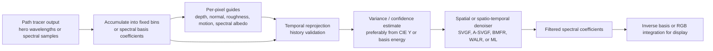
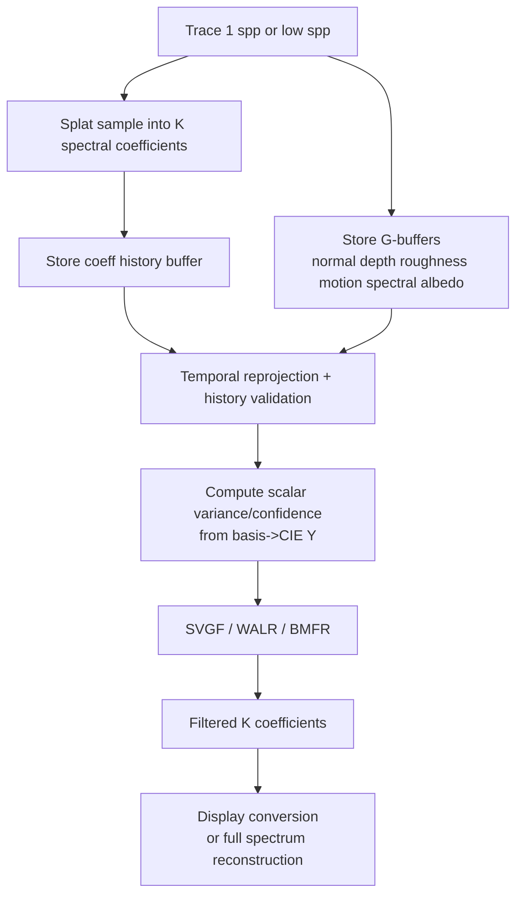

# GPU-Friendly Denoising for a Spectral Path Tracer

## Executive summary

For a **modern desktop, vendor-agnostic, real-time spectral path tracer**, the strongest overall choice is a **shader-based spatio-temporal denoiser built around SVGF or A-SVGF, operating on a fixed spectral basis or fixed spectral bins rather than on raw stochastic wavelengths**. That recommendation follows from three converging facts. First, **Vulkan compute is universally available on Vulkan devices**, and **HLSL is now a first-class Vulkan shading language via SPIR-V**, so a single cross-vendor shader codebase is realistic on Vulkan and DirectX 12. Second, **SVGF and its adaptive descendants were explicitly designed for real-time reconstruction from 1 spp path-traced input**. Third, spectral rendering can be made denoiser-friendly by **projecting spectra to a small number of coefficients**, which prior rendering papers show is compact and efficient on GPU. citeturn31view3turn35view0turn39search2turn39search13turn13view0turn13view2

If you can tolerate more integration work and your signal is mostly **diffuse indirect lighting**, a **regression-based denoiser** is the next-best option. **BMFR** was proposed as a **real-time 1 spp reconstruction method**, and **WALR** reports **about 3.0 ms at 1920×1080** on modern graphics hardware while improving temporal stability and matching the reference better than the prior real-time regression method; however, the WALR paper is explicitly scoped to **diffuse indirect lighting**, so it is not a universal beauty denoiser. citeturn22search0turn23view0

If you want a machine-learning path, the most practical cross-vendor stack today is **ONNX Runtime**, not TensorFlow. On Windows, **DirectML** is designed for **low-latency, high-performance** real-time applications and supports **all DirectX 12-compatible GPUs**; on AMD/Linux, the current ONNX Runtime route is **MIGraphX**, because the **ROCm Execution Provider has been removed since ONNX Runtime 1.23**. TensorFlow’s cross-vendor story is materially weaker for this use case: the **TensorFlow DirectML plugin is discontinued**, Intel’s extension is **Intel-only**, and TensorFlow’s official **OpenCL backend is effectively TensorFlow Lite on Android**, not a desktop-renderer solution. citeturn8view0turn8view2turn7search1turn8view3turn8view4turn37view0turn37view1turn37view2

The short version is this:

- **Best default**: **spectral-basis SVGF or A-SVGF** in Vulkan or DirectX 12 compute shaders. citeturn39search2turn39search13turn31view3turn35view0
- **Best higher-quality analytic option** for diffuse-dominant GI: **WALR**, or **BMFR** if you want a more established regression baseline. citeturn23view0turn22search0
- **Best ML route**: a **custom ONNX denoiser** trained on spectral coefficients and auxiliary buffers, deployed with **ONNX Runtime + DirectML** on Windows and **ONNX Runtime + MIGraphX** on AMD/Linux. Use **OIDN GPU** as a useful library/fallback, but not as the first-choice architecture for a strict real-time spectral denoiser. citeturn8view0turn8view2turn8view3turn5view1turn6search3

## Spectral rendering changes the denoising problem

A spectral path tracer introduces a denoising problem that is **not just “RGB, but with more channels.”** If your renderer uses **hero wavelength sampling** or another stochastic wavelength strategy, the sampled wavelengths can vary per pixel and per frame, which makes naïve temporal accumulation and per-channel denoising unstable. The robust strategy is to **first splat spectral samples into a fixed representation**—either fixed wavelength bins or a compact basis—and only then apply temporal reprojection and spatial filtering. That is an engineering inference, but it is strongly supported by the combination of hero-wavelength spectral transport, compact spectral representations, and recent spectral-denoising research that explicitly denoises **spectral bins** or a **PCA-reduced representation**. citeturn14search0turn14search3turn13view0turn13view2turn16view1turn19search3

Two spectral representations stand out.

A **low-dimensional basis** is often the most attractive. Jakob and Hanika show that suitable reflectance spectra can be represented with a **low-dimensional parametric model** whose storage cost is **identical to RGB textures**, and the spectra can be evaluated with **as few as six floating-point instructions** at any wavelength. Peters and colleagues further show that compact spectral representations can support **real-time spectral rendering**, and in their demo renderer they report a **0.63 ms total frame time at 1920×1080** under their test conditions, illustrating that basis evaluation itself need not dominate the budget. citeturn13view0turn13view2

A **fixed-bin spectral image** is simpler conceptually and a better fit if you need exact control over narrow-band effects, unusual light sources, or diagnostic spectral output. The downside is memory bandwidth. A recent spectral Monte Carlo denoising pipeline addresses this by taking **16 spectral bins**, computing **PCA features** over them to preserve context, and then denoising with a network that reconstructs each bin while using the PCA features, depth, normals, and spectral albedo as guidance. That same line of work later reports that combining **spectral radiance, spectral albedo, and geometric features** outperforms RGB denoisers while moving toward **quasi-interactive** spectral rendering, which is encouraging but still not the same as a mature production real-time denoiser. citeturn16view1turn19search3turn19search4

In practice, the most reliable spectral-handling strategies are:

### Shared-weight denoising over spectral coefficients

Compute the denoiser’s **edge-stopping weights, variance estimates, and history validation** from geometry/material guides and from a scalar spectral-energy proxy such as **CIE Y** or basis-projected luminance, then **apply the same weights to every spectral coefficient**. This preserves relative spectral shape much better than independently learning or estimating different spatial kernels for every wavelength. This is an implementation recommendation derived from how SVGF uses luminance variance, how regression denoisers use auxiliary features, and how current spectral ML papers retain low-dimensional spectral context alongside geometry. citeturn39search2turn23view0turn16view1turn19search3

### PCA or other linear transforms before denoising

When spectra are smooth or correlated, **PCA or another linear basis** frequently gives the best bandwidth/quality tradeoff. The spectral Monte Carlo denoiser poster reports using the **first three principal components** to capture roughly **95% of variance** for contextual guidance, and the broader rendering literature shows that compact spectral bases are both feasible and efficient for rendering workloads. citeturn16view1turn13view0turn13view2

### Chromatic-aware guiding rather than pure RGB fallback

For a spectral renderer, guidance should remain **geometry- and material-aware**, not just color-aware. Normals, depth, roughness, motion vectors, and spectral-albedo features are stable guides. The newer spectral-denoising work explicitly includes **spectral albedo** and geometric features, which is the right direction for wavelength-dependent effects that an RGB-only guide can erase. citeturn19search3turn16view1



## Algorithm options

### Spatial filters

The classic baseline is the **edge-avoiding à-trous wavelet filter**. Dammertz et al. introduced it specifically for noisy Monte Carlo global illumination and reported **real-time rates**. Its appeal in a spectral renderer is straightforward: it is easy to implement in **compute shaders**, portable across APIs, and its weights can be derived once per pixel neighborhood from **depth, normals, roughness, and optionally albedo**, then reused across all spectral coefficients. The main limitation is also well known: spatial filtering alone cannot fully solve flicker or stabilize dynamic scenes, so it is best treated as a building block, not the whole denoiser. citeturn38search1

For spectral data, a pure “per-wavelength independent à-trous” implementation is not the best design unless the wavelength count is tiny and fixed. A better approach is to denoise a **small basis vector** or a **fixed-bin stack** with shared weights. That keeps the filter physically agnostic while preserving spectral ratios. GPU implementation is simple: each pass is a standard separable or non-separable neighborhood gather, and the work maps cleanly to Vulkan or DirectX 12 compute. Performance is generally favorable because the method is bandwidth-heavy but arithmetic-light. Integration complexity is low to moderate. The pros are simplicity, debuggability, and total vendor neutrality. The cons are **blur bias**, limited feature reconstruction compared with regression/ML, and poor temporal behavior if used without reprojection. citeturn38search1turn31view3turn35view0

### Temporal accumulation as a category

**Temporal reprojection with history validation** deserves separate treatment because it is not optional in a real-time path-tracing denoiser. Even when it is not marketed as a standalone denoiser, it is the highest-return stage in the pipeline: reused history effectively raises the sample count at extremely low cost. WALR explicitly builds its pipeline on **temporal accumulation** plus a spatial regression stage, and SVGF’s core claim is that temporal accumulation combined with a variance-guided wavelet filter produces a temporally stable result from extremely noisy input. citeturn23view0turn39search2

For spectral rendering, the key requirement is that the **history buffer store a fixed spectral representation**, not raw stochastic hero wavelengths. History validation should remain geometry-based: depth, world or view-space normal, motion vector, roughness or material class, and optional albedo/basis confidence. The performance cost is excellent—usually among the cheapest passes in the stack—and integration complexity is moderate because it touches scene motion, disocclusion logic, and material changes. The pros are enormous quality return per millisecond. The cons are ghosting, lag under lighting changes, and the need for good reprojectable spectral state. citeturn39search2turn23view0turn14search0

### Spatio-temporal analytic denoisers

**SVGF** remains the best first architecture for a portable spectral denoiser. The original paper explicitly targets **one path per pixel** global illumination and uses **temporal accumulation** plus **spatiotemporal luminance variance estimates** to drive a hierarchical wavelet filter. A later adaptive version, commonly called **A-SVGF**, introduces gradient-based adaptation and was used in real-time path tracing work such as Quake II RTX. The crucial reason SVGF adapts well to spectral rendering is that it is **signal-agnostic with respect to transport**: the denoiser mostly cares about guide features, history validity, and a scalar confidence/variance channel. That fits very naturally with denoising spectral coefficients instead of RGB. citeturn39search2turn39search13turn39search7

A spectral SVGF implementation should compute variance from either **CIE Y** or a stable basis-energy scalar, then run the temporal and wavelet stages on **K spectral coefficients**. If K is small, this is viable within a 16–33 ms frame budget on current desktop GPUs, especially if your path tracer is already bandwidth-aware. GPU implementation is excellent in shaders and maps directly to Vulkan, DX12, OpenCL, or SYCL kernels. Integration complexity is medium. The pros are maturity, portability, temporal stability, and clean adaptation to spectral bases. The cons are hand-tuning, potential gradient flattening on difficult specular content, and several passes’ worth of memory traffic. citeturn39search2turn39search13turn31view0turn31view1

**BMFR** and **WALR** are the leading regression-style alternatives. BMFR was proposed as a **real-time reconstruction pipeline tailored for path-traced 1 spp input**, and its reported contribution is being **1.8× faster** and better in objective quality than the prior real-time state of the art. It is attractive for spectral rendering because linear regression over features can be applied coefficient-wise while using a common feature system. However, BMFR’s blockwise structure complicates artifact suppression and implementation. citeturn22search0turn22search1

**WALR** improves on BMFR by replacing the blockwise solver with a **per-pixel weighted linear regression solver** built around **edge-aware à-trous averaging** and edge tracing. The paper reports **temporally more stable results** and better SSIM/RMSE than the previous real-time regression method while running in **about 3.0 ms at 1920×1080** on modern hardware. That published timing is excellent, but there is an important scope caveat: WALR is framed as a denoiser for **diffuse indirect lighting**, not arbitrary full-beauty path-traced signals. For a spectral tracer, that makes WALR especially appealing if you already **split signals into diffuse and specular lobes** and are willing to apply different policies to each. GPU implementation is very good in shaders; portability is high at the algorithm level even though the published implementation is **DirectX-based** and came from AMD. Integration complexity is medium to high. The pros are standout quality-per-millisecond on the covered signal. The cons are narrower signal scope and more implementation work than SVGF. citeturn23view0turn34view1

### Machine-learning denoisers

A learned denoiser gives you the best chance of beating analytic filters for difficult effects, but only if you are willing to own the **data pipeline, backend fragmentation, and spectral representation design**.

The historically important ML baselines are **KPCN** and the **recurrent denoising autoencoder** for image sequences. KPCN predicts **spatially varying kernels** from noisy and auxiliary inputs, which makes it a natural fit when you want to preserve fine structure and still keep the “filter-weights-applied-to-signal” mental model. The recurrent autoencoder approach directly targets **interactive reconstruction of Monte Carlo image sequences**, which is closer to real-time path tracing as a problem. Both are good architectural inspirations for a spectral renderer, but neither gives you a production-ready desktop runtime by itself. citeturn38search10turn38search7

For deployment, **ONNX Runtime** is the most practical cross-vendor inference layer. The **DirectML Execution Provider** is specifically documented as suitable for **high-performance, low-latency applications such as games and other real-time applications**, and it supports any **DirectX 12-capable GPU**, including AMD, Intel, and NVIDIA. ONNX Runtime also provides guidance and APIs for **device tensors** and **I/O binding**, which are precisely what you want in a renderer so that data stays resident on the GPU instead of bouncing through PCIe. On Windows, this is the cleanest ML path. On AMD/Linux, the current ONNX Runtime route is **MIGraphX**; the **ROCm EP has been removed** and AMD’s current install guidance points users to **onnxruntime-migraphx** packages. citeturn8view0turn8view1turn8view2turn7search2turn7search1turn8view3turn8view4

Spectral handling for ML should almost always be **basis- or bin-based**, not arbitrary raw-wavelength input. The recent spectral Monte Carlo denoising work does exactly that: one line of work denoises **spectral bins**, augments them with **PCA features**, and later reports that combining **spectral radiance, spectral albedo, and geometric features** reduces chromatic noise better than RGB denoisers. Those are promising primary results, but they are still research-stage. The poster explicitly says that complex scenes still required **too many samples to denoise at an interactive frame rate**, which is exactly why I would recommend **custom ONNX deployment of a small basis-space model** over directly adopting the published spectral network as-is. citeturn16view1turn19search3turn19search4

**Intel Open Image Denoise** sits in an interesting middle ground. It is an open-source ML denoiser with **multi-vendor GPU support**—Intel Xe, NVIDIA Turing and newer, AMD RDNA 2 through RDNA 4, and Apple GPUs—and its documentation says it can be suitable not only for offline rendering but also, depending on hardware, for **interactive or even real-time ray tracing**. It now exposes **fast** and **balanced** quality modes specifically recommended for interactive and real-time use, and it supports **external memory import from DX12 and Vulkan** so you can avoid round-tripping through host memory. However, OIDN’s stock models are built around conventional beauty/albedo/normal semantics; for a spectral renderer, the most defensible use is either **denoising a compact basis in multiple passes** or **training a custom model with OIDN’s toolkit**. That makes it a useful library and fallback, but not the most natural first architecture for a strict 16 ms spectral real-time path tracer. citeturn5view1turn6search3turn6search4

## Cross-vendor backends, libraries, and frameworks

The strongest vendor-agnostic **shader** backend is **Vulkan**. Khronos documents compute as a **mandatory feature** of Vulkan, which means every Vulkan implementation can run compute shaders, including headless compute. Khronos also documents **HLSL as a first-class Vulkan shading language**, compiled to SPIR-V via DXC. For a denoiser, this is a major advantage: you can realistically maintain one HLSL shader codebase for **DX12 and Vulkan**, avoiding a split between “engine shaders” and “denoiser shaders.” citeturn31view3turn35view0

**DirectX 12** is the strongest Windows-only backend. The relevant point is not just that DX12 compute is mature; it is that **DirectML interops directly with DX12 devices and resources**. ONNX Runtime’s DirectML path can run on an existing DX12 device/queue, and AMD’s guide shows how to map an existing **ID3D12Resource** into ONNX Runtime as a tensor. If your target is Windows desktop GPUs from all three major vendors, this is the cleanest path to hybrid render+ML scheduling. The main drawback is platform scope, not hardware scope. citeturn8view0turn8view2turn36view0

**OpenCL** remains genuinely cross-platform and is still a credible choice for standalone compute kernels. Khronos describes OpenCL as an open, royalty-free standard for **cross-platform parallel programming of diverse accelerators**, and OpenCL 3.1 continues to bring broadly deployed capabilities such as **SPIR-V ingestion** into the core. For denoising specifically, OpenCL is workable, but it is no longer the most ergonomic path when your denoiser must interoperate tightly with a real-time graphics engine. Vulkan or DX12 usually wins on interop and tooling for that scenario. citeturn31view0

**SYCL** is the best answer if you want **single-source C++ kernels** rather than graphics-style shaders. Khronos defines it as an open, cross-platform abstraction layer for writing code against heterogeneous devices in modern C++. The practical caveat is that **performance portability is not guaranteed** and implementations differ. Intel’s overview is candid about that and also highlights the major implementations, while AdaptiveCpp positions itself as a **community-driven compiler/runtime for CPUs and GPUs from all vendors**, including CUDA, HIP/ROCm, OpenCL, and Intel backends. For a denoiser library that you want to write once in C++, SYCL is attractive. For a denoiser that must be deeply embedded into a frame graph with ray tracing, swapchains, motion vectors, and descriptor heaps, Vulkan/DX12 still tend to be simpler shipping targets. citeturn31view1turn31view2turn27search20turn27search4

For **ML inference frameworks**, the conclusion is sharper. **ONNX Runtime** is the practical choice. **TensorFlow** is not. Microsoft’s own documentation now marks the **TensorFlow DirectML plugin as discontinued**, Intel’s TensorFlow extension exposes **Intel XPU and CPU support**, and TensorFlow’s official **OpenCL path is TensorFlow Lite on Android**, not a desktop inference backend for a renderer. That does not make TensorFlow useless for training—only poor as the deployment/runtime answer for your denoiser. citeturn37view0turn37view1turn37view2

There is also an emerging **Vulkan-native ML** path. Arm’s **ML Emulation Layer for Vulkan** says it can execute ML workloads on **any Vulkan compute capable device**, exposing `VK_ARM_data_graph` and `VK_ARM_tensors`. Khronos’ corresponding sample documentation describes **data graph pipelines** as a new pipeline type that is especially suited to **machine learning workloads** and can replace sequences of compute pipelines. This is promising for a future “all-Vulkan” ML denoiser, but today it is still early-stage and much less battle-tested than ONNX Runtime + DirectML or classic shader-based denoisers. citeturn30view0turn30view1

Finally, two items in your prompt are important mostly by exclusion. **OpenXR** is not a denoising framework; it is the formal API/specification layer for XR runtimes and related tooling. It matters if your path tracer feeds an HMD or remote XR pipeline, and Tauray shows that a cross-platform renderer can expose **`--display=openxr`** alongside real-time path tracing and denoisers, but OpenXR does not solve denoising by itself. **OpenVKL** is a **volume kernel library**, not a denoiser, and its current GPU support is **Intel SYCL beta**, so it is not a vendor-agnostic denoiser component for your use case. citeturn28view1turn34view0turn11search1turn11search3

## Comparison and recommendations

The table below is a synthesis of the primary papers and official documentation cited throughout the report.

| Option | Category | Performance fit for 16–33 ms frame budgets | Quality and temporal behavior | Spectral compatibility | Vendor portability | Implementation effort | Evidence |
|---|---|---|---|---|---|---|---|
| Edge-aware à-trous / joint bilateral | Spatial | **Strong** if coefficient count is small | Good local cleanup; weak temporal stability alone | **Good** if weights are shared across basis/bin channels | **Very high** in Vulkan/DX12/OpenCL/SYCL shaders | Low to medium | citeturn38search1turn31view3turn31view0turn31view1 |
| Temporal reprojection + clamp | Temporal | **Excellent** | Essential history reuse, but not sufficient alone | **Excellent** if state is stored in fixed bins/basis coeffs | Very high | Medium | citeturn39search2turn23view0turn14search0 |
| SVGF / A-SVGF | Spatio-temporal | **Strong** | Strong real-time quality; good temporal stability; mature | **Excellent** with basis/bin adaptation | **Very high** as an algorithm and shader architecture | Medium | citeturn39search2turn39search13turn39search7turn31view3turn35view0 |
| BMFR | Spatio-temporal regression | **Strong** | Strong detail reconstruction; real-time 1 spp target | **Excellent** in coefficient space | High | Medium to high | citeturn22search0turn22search1 |
| WALR | Spatio-temporal regression | **Very strong** for covered signals; paper reports ~3.0 ms at 1080p | Excellent temporal stability and gradient preservation for diffuse indirect lighting | **Excellent** for diffuse spectral bases | High algorithmically; reference work is AMD/DX | High | citeturn23view0turn34view1 |
| Custom ONNX denoiser via ONNX Runtime | Machine learning | **Conditional** on model size and backend | Potentially best quality if well-trained; excellent flexibility | **Excellent** if trained in basis/bin space | Medium to high; Windows is easiest, Linux/AMD path is split | High | citeturn8view0turn8view1turn8view2turn8view3turn8view4 |
| OIDN GPU | Machine learning library | **Conditional**; docs position it for interactive and even real-time depending on hardware | Very strong image quality; stock models are not spectral-native | Medium unless you use basis passes or custom training | **High** across Intel, AMD, NVIDIA, Apple | Low to medium | citeturn5view1turn6search3turn6search4 |
| Specialized spectral ML denoisers | Machine learning research | **Research-stage** for strict real-time | Promising spectral fidelity; not yet production-mature | **Native** | Medium | Very high | citeturn16view1turn19search3turn19search4 |

The **best three approaches** for your stated constraints are the following.

### Spectral-basis SVGF or A-SVGF in Vulkan or DX12 shaders

This is the best **default architecture**. It is the cleanest match to your constraints: GPU-friendly, genuinely vendor-agnostic, fast enough to plausibly live inside a 16–33 ms frame, and adaptable to spectral data without waiting for any vendor library. Use **fixed spectral coefficients** as the denoised signal, compute variance and clamping from a scalar luminance proxy, and keep all guide features conventional: motion, depth, normals, roughness, albedo or spectral albedo. Build it in **Vulkan compute** or **DX12 compute**, ideally with a shared HLSL codebase. citeturn39search2turn39search13turn31view3turn35view0turn13view0turn13view2

### WALR or BMFR over spectral coefficients

Choose this when you are ready to spend more engineering effort for better reconstruction of gradients and difficult low-spp diffuse GI. If your renderer already separates **diffuse** and **specular** transport, WALR is particularly attractive for the diffuse branch because the published timing is exceptionally strong and the method was built around preserving gradients rather than flattening them. If you want a broader research baseline or a less signal-specific reference, BMFR is the safer starting point. Either way, keep the denoised state in a compact basis. citeturn23view0turn22search0turn34view1

### A custom ONNX denoiser in basis space

This is the best **ML recommendation**, but only if you are willing to own the model. Train on **basis coefficients + spectral albedo coefficients + normals + depth + roughness + motion**, then deploy through **ONNX Runtime**. On Windows, use **DirectML** and bind input/output tensors to existing DX12 resources. On AMD/Linux, use **MIGraphX**. This route gives you the best chance of learning spectral-specific priors that RGB denoisers miss, but it is also the route with the highest backend complexity and dataset burden. citeturn8view0turn8view1turn8view2turn8view3turn8view4turn19search3turn19search4

## Implementation blueprint

A practical integration path is to **keep the path tracer and denoiser in the same GPU graph**, and to treat the spectral representation as first-class frame-graph data.



A solid first implementation looks like this:

### Choose the spectral state layout

If your tracer uses stochastic wavelengths, do **not** reproject raw wavelength samples. Instead, splat each sample into **K fixed coefficients** or **N fixed bins**. For most reflectance-heavy game-like content, **K in the low single digits** is the right starting point; the rendering literature shows that compact spectral representations can be highly efficient, though spiky emission spectra and unusual materials can require more coefficients. citeturn13view0turn13view2

### Keep guide features conventional

Keep the denoiser’s guides almost completely conventional: motion vectors, depth, normals, roughness, material ID, and albedo. The only spectral additions I would make initially are **spectral albedo coefficients** and a **basis-derived scalar luminance/confidence**. That keeps the cost near an RGB denoiser while giving the filter enough information not to collapse wavelength-dependent behavior. citeturn19search3turn16view1

### Compute filter weights once, apply them to all coefficients

This is the central spectral adaptation. The denoiser should decide **where to blur** from guides and variance, then apply those weights to the full coefficient vector.

```cpp
struct PixelState {
    float coeff[K];          // spectral basis coefficients or fixed bins
    float depth;
    float3 normal;
    float roughness;
    float2 motion;
    float albedoCoeff[A];    // optional compact spectral albedo
};

float luminance_from_basis(const float coeff[K]) {
    // Precompute CIE-Y projection of the chosen spectral basis.
    float y = 0.0;
    for (int k = 0; k < K; ++k) y += coeff[k] * cieY_basis[k];
    return y;
}

void denoise_pixel(int2 px) {
    PixelState cur = gCurrent[px];
    PixelState hist = reproject_history(px, cur.motion);

    bool valid = history_valid(cur.depth, hist.depth,
                               cur.normal, hist.normal,
                               cur.roughness, hist.roughness);

    float coeffTemporal[K];
    if (valid) {
        float alpha = choose_history_alpha(cur, hist);
        for (int k = 0; k < K; ++k)
            coeffTemporal[k] = lerp(cur.coeff[k], hist.coeff[k], alpha);
    } else {
        for (int k = 0; k < K; ++k)
            coeffTemporal[k] = cur.coeff[k];
    }

    float varY = estimate_variance(luminance_from_basis(coeffTemporal));

    float weights[MAX_TAPS];
    int2 taps[MAX_TAPS];
    build_edge_aware_weights(px, cur.depth, cur.normal, cur.roughness,
                             cur.albedoCoeff, varY, taps, weights);

    float coeffOut[K] = {0};
    float wsum = 0.0;
    for (int i = 0; i < MAX_TAPS; ++i) {
        PixelState n = gCurrent[taps[i]];
        float w = weights[i];
        for (int k = 0; k < K; ++k)
            coeffOut[k] += w * n.coeff[k];
        wsum += w;
    }
    for (int k = 0; k < K; ++k)
        gDenoised[px].coeff[k] = coeffOut[k] / max(wsum, 1e-6);
}
```

This pattern covers **à-trous**, **SVGF**, **BMFR/WALR-style regression**, and even **KPCN-style predicted kernels**: the denoiser logic changes, but the spectral strategy stays the same. It is directly motivated by the way SVGF uses scalar variance, by the feature-driven nature of regression denoisers, and by recent spectral-ML work that keeps low-dimensional spectral context alongside geometry. citeturn39search2turn23view0turn16view1turn19search3

### Use ONNX Runtime only when you need learned priors

If you implement the ML route on Windows, the critical optimization is **zero-copy or near-zero-copy GPU I/O**. ONNX Runtime’s **DirectML EP** can be created on your existing DX12 device and command queue, and AMD’s guide shows how to map an existing **ID3D12Resource** into an `Ort::Value`. That is the difference between a plausible real-time ML denoiser and one that burns its budget in transfers. citeturn8view0turn8view1turn36view0

```cpp
// Sketch of DX12 + ONNX Runtime + DirectML resource binding.
Ort::SessionOptions so;
const OrtDmlApi* ortDml = nullptr;
Ort::GetApi().GetExecutionProviderApi("DML", ORT_API_VERSION,
    reinterpret_cast<const void**>(&ortDml));

// Reuse the renderer's DX12 device and compute queue.
ortDml->SessionOptionsAppendExecutionProvider_DML1(
    so, dmlDevice.Get(), computeQueue.Get());

Ort::Session session(env, modelPath, so);

// Map an existing DX12 resource to an Ort tensor.
void* gpuAlloc = nullptr;
Ort::ThrowOnError(ortDml->CreateGPUAllocationFromD3DResource(
    spectralCoeffResource.Get(), &gpuAlloc));

Ort::MemoryInfo mi("DML", OrtAllocatorType::OrtDeviceAllocator,
                   0, OrtMemTypeDefault);

Ort::Value input = Ort::Value::CreateTensor(
    mi,
    gpuAlloc,
    static_cast<size_t>(spectralCoeffResource->GetDesc().Width),
    shape.data(),
    shape.size(),
    ONNX_TENSOR_ELEMENT_DATA_TYPE_FLOAT
);

// Run inference with GPU-resident input/output tensors.
session.Run(runOptions, inputNames.data(), &input, 1,
            outputNames.data(), outputValues.data(), outputCount);
```

If you need full cross-platform graphics/ML unification without DX12, stay with shader denoisers for now, or treat **Vulkan ML** through Arm’s emulation layer and data-graph extensions as exploratory rather than production. citeturn36view0turn30view0turn30view1

### Reference codebases worth studying

For a **cross-platform Vulkan path tracer** with denoiser options already exposed, **Tauray** is one of the best public references: it uses **Vulkan**, supports real-time path tracing, and exposes **`--denoiser=svgf`** and **`--denoiser=bmfr`**, with **OpenXR** display support as well. For a **DirectX 12 research framework**, AMD’s **Capsaicin** is useful if you want a home for WALR-like work or a DirectML-based prototype. For a general-purpose off-the-shelf denoiser library, **OIDN** is the strongest multi-vendor open-source library today. citeturn34view0turn34view1turn24search0turn24search2turn5view1

## Open questions and limitations

The main limitation in the public literature is that **production-grade real-time denoisers are still overwhelmingly evaluated on RGB beauty or on restricted signals such as diffuse indirect lighting**, while **public spectral denoising work is recent and still research-stage**. That means the report’s strongest recommendations are necessarily **architectural adaptations** of mature real-time denoisers to spectral coefficient space, rather than a turnkey production spectral denoiser you can drop in today. citeturn39search2turn23view0turn19search3turn19search4

There is also a backend fragmentation issue on the ML side. Windows has a strong cross-vendor path via **DirectML**, but Linux does not currently have an equally clean “everyone, one backend” equivalent in ONNX Runtime; AMD points users to **MIGraphX**, and the old **ROCm EP** has been removed. That does not block ML deployment, but it does reduce the elegance of a single vendor-neutral packaging story compared with analytic shader denoisers. citeturn7search1turn8view3turn8view4

Finally, the “right” spectral basis depends on the renderer’s content. Compact bases work extremely well for many reflectance and illumination cases, but **spiky emission spectra, fluorescence, or other unusual wavelength phenomena may require higher-dimensional bases or fixed-bin tails**. That is not a reason to avoid basis-space denoising; it is a reason to validate the chosen basis against your hardest materials before you lock the denoiser API. citeturn13view2turn19search3
