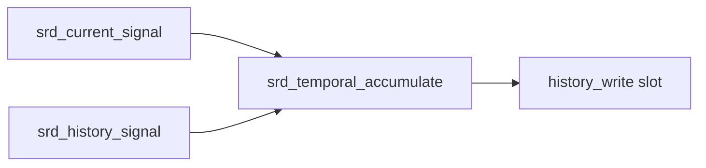
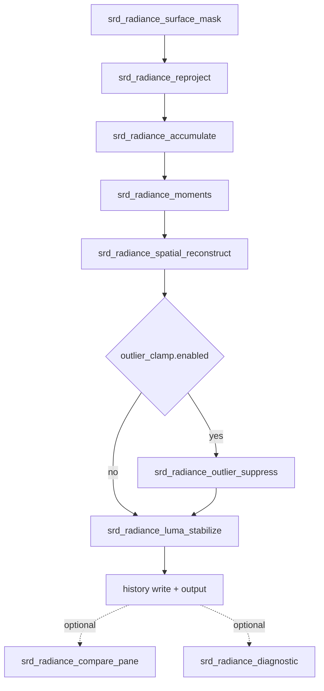
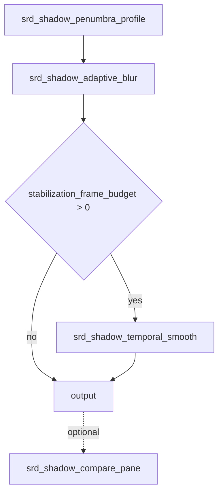
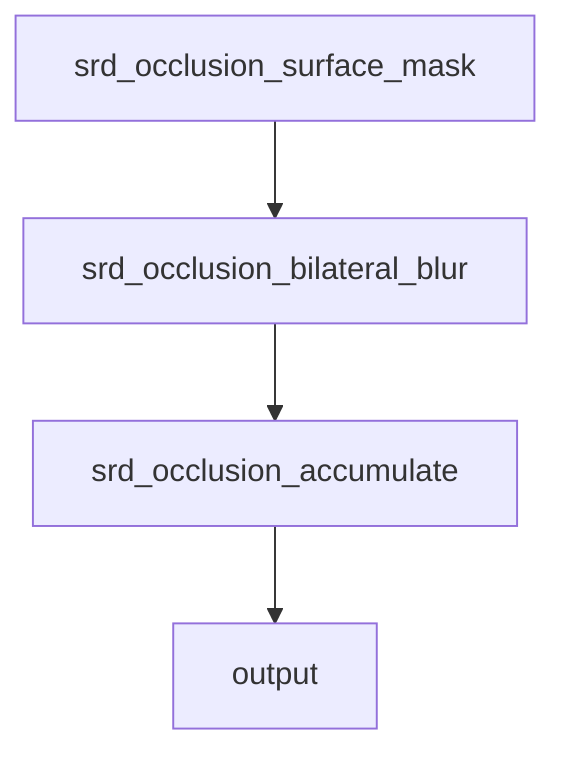

# SRD Shader Design Document

This document describes SturdyEngine's shader-side design for SRD (Sturdy Real-Time Denoiser). It is the companion to `docs/srd.md`, which establishes the host-side Rust API and accepted public terminology.

This document is the source of truth for what SRD's compute passes are, what they consume, what they produce, how they are named, and how they are organized. It is written for engineers and AI assistants who are implementing or reviewing SRD shader work.

## 1. Purpose and scope

SRD ships engine-native denoising for sparse rendering signals: ray-traced lighting, hardware path tracing, ray-traced ambient occlusion, ray-traced shadows, and future spectral/GI/reflection products. The shader layer turns noisy input plus G-buffer guides plus persistent history into a stable, low-variance output that downstream lighting, post-processing, and HUD systems can consume without flicker.

The scope of this document:

- shader file and module organization,
- per-family pass graphs,
- shared shader subsystems,
- specialization/permutation axes,
- the host-visible shader contract (bindings, constants, dispatch shape),
- per-pass quality and stability requirements,
- an implementation risk checklist.

What this document does **not** specify:

- exact tuning constants, weight curves, or numerical thresholds — those belong in the source files and are derived from in-engine measurement and public literature, not from any vendor SDK,
- HLSL-style preprocessor permutation layouts — SRD uses Slang and Rust descriptor specialization,
- API verbs already covered by `docs/srd.md`.

## 2. Design principles

1. **Rust owns planning.** The shader layer is a passive consumer of `SrdDispatchDesc` descriptions emitted by `SrdInstance`. Shaders never re-derive scheduling logic that Rust already owns.
2. **Bindings are SRD-named.** Every texture, sampler, and constant block carries an `srd_` prefix in shader code. No vendor SDK identifiers, family names, or file-name conventions leak in.
3. **Pass graphs are SRD-defined.** SRD does not borrow its pass ordering, pass splits, or pass joins from any third-party denoiser. If a public technique is referenced, that reference is to a paper or open course material, not to a vendor SDK shader.
4. **Behavior over elegance.** A pass exists when measurement shows it improves stability or quality on engine workloads. Passes are not added because some other denoiser has them; passes are not removed because a refactor makes the graph look cleaner.
5. **Single source for shared logic.** Reprojection, history validation, edge-stopping weights, and variance tracking live in shared Slang modules with explicit interfaces, not duplicated per pass.
6. **Failure is loud.** Every pass must produce a defined output even when its inputs are invalid (sky, out-of-range view depth, missing history). Silent NaN/Inf propagation is a bug.
7. **History is SRD-owned.** Persistent history lives in `SrdPoolClass::History` slots managed via `SrdHistoryRing`. Scratch lives in `SrdPoolClass::Scratch`. Shaders never assume which physical texture is "current" — they consume slot indices supplied by the dispatch description.

## 3. Cleanroom posture

SRD is a cleanroom denoiser. Shader files and shader logic are authored from first principles, public literature, and engine measurement — not from third-party denoiser implementations.

Operational rules:

- Do not import, paraphrase, or transliterate code from any vendor denoiser SDK.
- Public literature is acceptable input. Reference papers and course material by citation in a comment when you take an idea from them.
- Pass names, file names, shader symbol names, and tuning constants must be SRD-original.
- If a design choice would require copying a vendor SDK's internal pass split, ordering, or tuning to be "correct," choose a different design.

The `docs/srd.md` taxonomy is authoritative for public-facing names. This document extends that taxonomy into shader files.

## 4. Naming and file conventions

### 4.1 Shader file names

SRD shader files live under `crates/sturdy-engine-testbed/shaders/` (for now; long-term home is the engine crate's shader directory) and use this pattern:

```
srd_<family>_<pass>.slang
```

Concrete current and reserved file names:

| File | Family | Pass |
|---|---|---|
| `srd_temporal_accumulate.slang` | reference | reference temporal accumulation (shipping) |
| `srd_clear_history.slang` | global | zero out a history slot (reserved) |
| `srd_radiance_surface_mask.slang` | radiance | surface validity + variance hint |
| `srd_radiance_reproject.slang` | radiance | locate previous-frame footprint |
| `srd_radiance_accumulate.slang` | radiance | temporal blend + history-length update |
| `srd_radiance_moments.slang` | radiance | track first and second luminance moments |
| `srd_radiance_spatial_reconstruct.slang` | radiance | variance-guided edge-aware filter |
| `srd_radiance_luma_stabilize.slang` | radiance | luminance-only temporal polish |
| `srd_radiance_outlier_suppress.slang` | radiance | optional luminance clamp pass |
| `srd_radiance_compare_pane.slang` | radiance | split-screen comparison region |
| `srd_radiance_diagnostic.slang` | radiance | debug visualization |
| `srd_shadow_penumbra_profile.slang` | shadow | per-tile penumbra width estimate |
| `srd_shadow_adaptive_blur.slang` | shadow | penumbra-sized geometry-aware blur |
| `srd_shadow_temporal_smooth.slang` | shadow | temporal stabilization |
| `srd_shadow_compare_pane.slang` | shadow | split-screen comparison region |
| `srd_occlusion_surface_mask.slang` | occlusion | surface validity for AO/dirAO |
| `srd_occlusion_bilateral_blur.slang` | occlusion | bilateral blur with normal/depth stops |
| `srd_occlusion_accumulate.slang` | occlusion | temporal blend |

### 4.2 Binding names

Every binding name is `srd_` prefixed. Examples already in shipping code: `srd_current_signal`, `srd_history_signal`, `srd_current_sampler`, `srd_history_sampler`. Reserved patterns for upcoming passes:

- `srd_<family>_input`, `srd_<family>_history_read`, `srd_<family>_history_write`,
- `srd_guide_view_depth`, `srd_guide_normal_roughness`, `srd_guide_motion`, `srd_guide_material`,
- `srd_<family>_moments`, `srd_<family>_history_length`, `srd_<family>_surface_mask`,
- `srd_<family>_diagnostic_out`.

### 4.3 Constant block names

Constant blocks use the Rust struct name from `srd_denoiser.rs` exactly, written in PascalCase on the shader side: `SrdTemporalConstants`, `SrdSignalMomentsConstants`, and future blocks `SrdRadianceStageConstants`, `SrdShadowStageConstants`, `SrdOcclusionStageConstants`. Field names use camelCase in shaders to match Slang/HLSL conventions but stay 1:1 with their Rust counterparts in meaning and order.

### 4.4 Slang module names

Shared logic lives in `srd_common.slang`, `srd_history.slang`, `srd_variance.slang`, `srd_filter.slang`, `srd_packing.slang`. Family-specific helpers live in `srd_radiance.slang`, `srd_shadow.slang`, `srd_occlusion.slang`. No NRD-style `_Config.hlsli`/`_Resources.hlsli` split — Slang's module system covers both responsibilities.

## 5. Shared subsystems

### 5.1 Guide interpretation

SRD consumes a small, well-defined G-buffer surface:

- **Linear view depth** (single channel, positive into the scene). Out-of-range or sky is signaled by a value at or above `SrdCommonSettings::effective_range`. There is no separate "sky bit." Shaders test against the range constant.
- **Normal + roughness** in a single packed texture per `SrdShaderContract::normal_packing`. Default encoding is RGBA8 signed-octahedral with roughness in alpha.
- **Motion vectors** in pixel units, previous-minus-current, per `SrdShaderContract::motion_vectors`. Jitter compensation is applied by the renderer before SRD reads them.
- **Material identifier** (optional, single channel). When absent, shaders treat all surfaces as the same material class.

Guide unpacking lives in `srd_packing.slang`. Every pass uses the same helpers; no pass implements its own unpacker.

### 5.2 History rings and the slot contract

History lives in slots managed by `SrdHistoryRing` on the Rust side. Each ring exposes `write_index` (the slot this frame writes) and `read_index` (the slot this frame reads). Shaders never see "current" or "previous" — they receive two storage handles bound to the names supplied by the dispatch description.

The host-side `rotate_history_ring` swaps these indices between frames. From the shader's perspective the two handles always behave the same way: one is read, the other is written.

`SrdHistoryMode::ZeroHistory` triggers a clear dispatch before the first denoising pass of that family in that frame. Shaders therefore do not need to special-case "first frame" — they can always read history and rely on the clear pass to have produced zero contents when needed. They do need to special-case low-history-length pixels for quality reasons; see 5.4.

### 5.3 Reprojection contract

Reprojection is centralized in `srd_history.slang`. The contract:

- Input: current pixel coordinate, current linear view depth, current world-space position (reconstructed from depth and the inverse view-projection in `SrdCommonSettings`).
- Output: a `SrdReprojection` struct containing previous-frame pixel coordinate, bicubic-footprint weights, a bilinear-fallback flag, and a per-tap validity mask.

Validity uses three tests in order: out-of-bounds rejection, depth/plane compatibility against previous linear view depth, normal compatibility against previous packed normal. Material-class mismatch downgrades the result to bilinear-fallback rather than rejecting it outright. Numerical thresholds are tunable per family through their stage constants.

### 5.4 Variance and history-length tracking

SRD tracks first and second luminance moments in a single `RG16F` slot per family, refreshed by `srd_radiance_moments.slang` (and equivalents for shadow/occlusion if measurement shows it is worth it). The host-side budgets are `SrdRadianceSettings::history_frame_budget` and `fast_history_budget`. The shader translates "frames of history accumulated" into a per-pixel `history_length` integer stored in a separate `R8_UINT` slot.

Quality rules:

- Pixels with `history_length < short_history_cutoff` (typically 4) get widened spatial support in the reconstruction pass.
- The accumulation blend weight is `clamp(1.0 / (history_length + 1), 1.0 / fast_history_budget, 1.0)`.
- Variance estimates use Welford-style online updates so single-frame outliers do not poison the running variance.

This is intentionally different from any vendor SDK's particular weighting or budgeting scheme; SRD owns these formulas.

### 5.5 Surface mask format

A surface mask is a per-16×16-tile `R8_UINT` texture (the exact tile size may move to 8×8 after measurement). Bit layout, low to high:

- bit 0: tile contains at least one in-range pixel,
- bit 1: tile contains at least one out-of-range/sky pixel,
- bit 2: tile is dominated by high-variance content,
- bit 3: tile is dominated by low-variance content,
- bits 4–7: reserved.

Downstream passes early-out on tiles with bit 0 unset. The mask is produced once per frame per family and consumed by every subsequent pass.

## 6. Family pipelines

### 6.1 Reference Temporal

Shipping today as `srd_temporal_accumulate.slang`. Single fullscreen pass: read current signal and history, write blended output.

Graph (mermaid):



This family does not consume guides and does not perform reprojection. It exists for progressive accumulation and as a quality baseline against which more sophisticated families are measured.

### 6.2 Radiance Stabilizer

Designed from first principles using publicly known temporal-spatial denoising ideas. The pass ordering is SRD-specific: reprojection and accumulation are separate dispatches so that reprojection results can be reused by both the radiance accumulator and an eventual specular re-projection path without re-running the test.



Pass intents:

- **Surface mask** — classify per-tile validity and high/low variance, write `srd_<family>_surface_mask`.
- **Reproject** — emit `SrdReprojection` per pixel into a scratch slot, including bicubic weights and validity.
- **Accumulate** — blend current input against bicubic-sampled history using the rules from 5.4. Update `history_length`.
- **Moments** — update running first and second luminance moments. Provides the variance signal consumed by reconstruction.
- **Spatial reconstruct** — single variance-guided edge-aware filter. The kernel is a 5×5 cross with adaptive radius (1 to 4 pixels) chosen per pixel from `history_length` and local variance. Edge-stopping weights use depth-plane distance, normal angle, roughness compatibility, and material class. SRD uses a single reconstruction pass with adaptive radius rather than multiple fixed-radius wavelet iterations; this is a deliberate divergence and may evolve based on quality measurement.
- **Outlier suppress** — optional. When `SrdRadianceSettings::outlier_clamp.enabled` is true, clamp pixels whose luminance exceeds `luminance_sigma` standard deviations above the local mean, preserving second-moment energy.
- **Luma stabilize** — temporal stabilization of luminance only, leaving chroma untouched, to suppress sub-pixel shimmer.
- **Compare pane** — copies raw input into the split-screen region.
- **Diagnostic** — writes per-pixel debug colors (variance, history length, rejection reason).

### 6.3 Shadow Stabilizer

SRD treats shadow denoising as a penumbra-width problem first: estimate the penumbra width per tile, then run a single adaptive blur sized by that estimate. SRD does not split blur and post-blur; one parametrized blur covers both jobs.



Pass intents:

- **Penumbra profile** — read penumbra signal, write a per-tile `R8` width estimate and a per-tile state (lit / occluded / mixed / invalid). Two channels share one texture.
- **Adaptive blur** — geometry-aware blur. Pixels in fully-lit or fully-occluded tiles skip filtering; pixels in mixed tiles get a Gaussian-like kernel sized by the local penumbra width. Edge-stops on depth and normal prevent leaking across surfaces.
- **Temporal smooth** — reprojects the previous blurred shadow, validates with depth/disocclusion, and blends.

### 6.4 Occlusion Stabilizer

Simpler than radiance — AO and directional AO are single-channel or low-channel signals with no specular complications.



Pass intents:

- **Surface mask** — same format as radiance but populated from AO-relevant guides only.
- **Bilateral blur** — normal-and-depth-weighted blur with radius from `SrdOcclusionSettings::spatial_radius` and `normal_weight_power`.
- **Accumulate** — temporal blend using motion vectors and the standard reprojection module.

## 7. Specialization axes

SRD specializes shaders along these axes. Each axis is a Rust-side decision baked into the `SrdPipelineDesc::shader_label` or, where Slang generics suffice, a generic parameter resolved at compile time.

- **Lobe content**: diffuse-only, specular-only, combined diffuse+specular. (Radiance only.)
- **Spectral layout**: RGB, fixed-bin spectral, compact spectral coefficients, per `SrdSpectralLayout`.
- **Translucent shadows**: on/off, per shadow stabilizer settings.
- **Outlier clamp**: on/off.
- **Variance tracking detail**: luminance-only vs full chroma.
- **History confidence input**: present/absent.
- **Material guide**: present/absent.

There is no "performance mode" toggle baked into shaders. Performance is achieved by removing or simplifying passes via the descriptor layer, not by switching internal shader paths.

## 8. Per-pass interface contract

Every SRD pass must document, at the top of its Slang source file, exactly four things:

1. **Reads** — the named bindings it samples, in pass-graph order.
2. **Writes** — the named bindings it writes, in pass-graph order.
3. **Constant block** — the name and Rust source of the constant struct it consumes.
4. **Dispatch shape** — the thread group size and the rule mapping `SrdCommonSettings::rect_size` to grid dimensions.

The Rust side enforces this contract via `SrdInstance::push_dispatch` validation; the shader side documents it for human review. A pass whose shader source disagrees with its `SrdDispatchDesc` is a bug.

## 9. Tuning and quality

Tuning constants are owned by SRD. They are derived through:

1. measurement against engine workloads (Cornell path-traced reference, the testbed RT shadow scene, RT AO scenes),
2. public literature (SVGF and follow-ups, A-trous wavelet filtering, ReSTIR variance reasoning, edge-aware bilateral filtering, online moment estimation),
3. iterative tightening once a pass is shipping.

SRD does **not** import tuning constants from any vendor SDK. If a public paper gives a default value, the comment in the shader cites the paper.

Acceptance criteria for a new pass:

- The pass produces a non-NaN output for every pixel in the testbed scenes.
- Enabling the pass improves a stability metric (rolling-window variance, frame-to-frame Δ-luminance histogram) without regressing image quality (mean-squared error against a converged reference) by more than 1%.
- The pass's measured cost on a reference GPU at 1080p is recorded in a comment.

## 10. Implementation risk checklist

When implementing or reviewing an SRD shader, walk this list before merging.

### 10.1 Cleanroom hygiene

- No identifier, comment, or structural choice traces to a vendor SDK shader.
- File names match section 4.1.
- Tuning constants either have a measurement justification or a public-literature citation in a comment.

### 10.2 Binding correctness

- Every binding is `srd_` prefixed.
- Read bindings appear before write bindings in declaration order.
- The constant block declared in shader matches the Rust struct field-for-field, in order.
- `SrdDispatchDesc::resources` declares the exact same set of read and write resources the shader uses.

### 10.3 Numerical robustness

- No division without a denominator guard.
- No `log` or `pow` on potentially negative inputs.
- Variance reads clamp to ≥ 0 before being used in a weight.
- History reads sanitize NaN/Inf to a defined fallback (current input).
- Output values are clamped to a finite, well-defined range before being written to storage.

### 10.4 Temporal behavior

- Reprojection uses `srd_history.slang`, not an inline copy.
- History rejection downgrades gracefully (bilinear fallback) before it discards entirely.
- `SrdHistoryMode::ZeroHistory` is honored by the host clear dispatch, not by a special path inside this shader.
- `frame_index == 0` does not require a separate code path; the history-length state machine handles it.

### 10.5 Dispatch behavior

- Thread group size is declared and documented.
- The grid dimensions for `SrdCommonSettings::rect_size` are derived consistently with `reference_grid_size` or its family-specific successor.
- Out-of-rect threads exit early before touching storage.
- Shared-memory tile size, halo, and barrier placement are documented in a single comment at the top of the shader.

### 10.6 Specialization parity

- All specialization axes used by this pass appear in `docs/srd_shaders.md` section 7.
- Each axis is realized via a Slang generic or specialization constant — not a runtime branch — unless measurement shows the runtime branch is faster and unbiased.

### 10.7 Diagnostics

- The shader has a corresponding `srd_<family>_diagnostic.slang` variant or documents why one is unnecessary.
- Validation output, when supported, writes deterministic colors documented in this file.

## 11. Acceptance signal

SRD's shader layer is considered complete when:

1. All four families have shipping shaders covering the pass graphs in section 6.
2. Every shader passes the section 10 checklist on review.
3. The testbed exposes a runtime toggle to switch between Reference Temporal, Radiance Stabilizer, Shadow Stabilizer, and Occlusion Stabilizer with their respective signals.
4. Engine measurement shows each non-reference family reaches its acceptance criteria from section 9 on at least one representative scene.

Until then, this document is the working specification. Update it as design decisions firm up — it should not lag behind the code.
